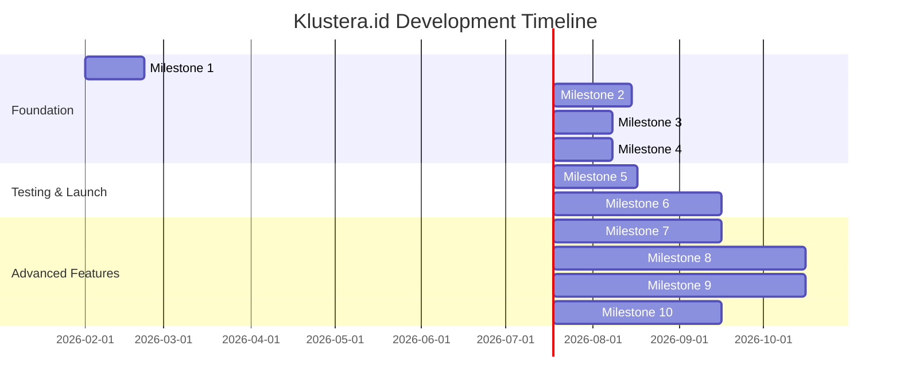

# 🗺️ Klustera.id - Development Roadmap

**Version:** 1.0.0-concept
**Last Updated:** 2026-01-06
**Status:** Pre-Development

---

## 📅 Overview

Klustera.id akan dikembangkan dalam 10 milestone besar, mulai dari MVP (Minimum Viable Product) hingga platform lengkap dengan integrasi IoT dan mobile apps. Total timeline estimasi: 18-24 bulan.

**MVP Target:** Milestone 1-4 (12 minggu)
**Public Launch Target:** Milestone 6 (6-7 bulan)
**Full Platform Target:** Milestone 10 (18-24 bulan)

---

## 🎯 Milestones Overview

---

## 📋 Detailed Milestones

### Milestone 1: MVP Foundation (Week 1-3)

**Timeline:** 3 weeks
**Goal:** Setup project infrastructure dan basic authentication system

**Deliverables:**

**Backend Setup:**
- [ ] Laravel 10 project initialization
- [ ] PostgreSQL 15 database setup dengan schema dasar
- [ ] Basic database migrations:
  - users table (admin, pengelola, resident roles)
  - complexes table (master data kompleks)
  - units table (data unit/rumah di kompleks)
  - residents table (data warga)
- [ ] Laravel Sanctum authentication setup
- [ ] Basic authorization (Role-based access control)

**Frontend Setup:**
- [ ] Tailwind CSS configuration
- [ ] Alpine.js integration
- [ ] FluxUI component library setup
- [ ] Basic layout (Navigation, Sidebar, Footer)

**DevOps:**
- [ ] GitHub repository setup
- [ ] CI/CD pipeline dengan GitHub Actions
- [ ] Staging environment di Coolify
- [ ] Environment variables management
- [ ] Basic monitoring setup (Sentry)

**Documentation:**
- [ ] API documentation structure
- [ ] Developer setup guide
- [ ] Database schema documentation

**Success Criteria:**
- Developer bisa clone repo dan run project locally dalam < 30 menit
- Basic authentication works (admin, pengelola, resident login)
- Database migrations run tanpa error
- Staging environment accessible

---

### Milestone 2: Core Features - Financial Management (Week 4-7)

**Timeline:** 4 weeks
**Goal:** Implementasi iuran collection dan payment tracking system

**Deliverables:**

**Iuran Management System:**
- [ ] Billing types configuration (Iuran Kebersihan, Iuran Keamanan, Iuran Satpam, dll)
- [ ] Automatic monthly billing generation
- [ ] Billing calculation engine (per-unit pricing)
- [ ] Invoice generation (PDF export)
- [ ] Payment status tracking (Unpaid, Partial, Paid, Overdue)

**Payment Integration:**
- [ ] Midtrans integration setup
- [ ] Payment methods support:
  - Bank Transfer (VA)
  - GoPay, OVO, Dana (e-wallets)
  - Credit Card (opsional untuk MVP)
- [ ] Payment notification webhook handling
- [ ] Automatic payment status updates
- [ ] Payment reconciliation system

**Financial Dashboard:**
- [ ] Overview dashboard untuk pengelola:
  - Total collected this month
  - Outstanding amount
  - Collection rate (%)
  - Overdue residents list
- [ ] Per-resident payment history
- [ ] Export laporan ke Excel/CSV

**Reminder System:**
- [ ] Automatic email/SMS/WhatsApp reminders (belum kirim, j overdue)
- [ ] Late fee calculation (jika ada)
- [ ] Dunning automation (3 reminders: 7 days, 14 days, 30 days overdue)

**Success Criteria:**
- Pengelola bisa generate monthly bills untuk semua units dalam 1 klik
- Residents bisa pay bills via Midtrans payment page
- Payment status updates automatically setelah Midtrans webhook
- Financial dashboard shows accurate collection metrics

---

### Milestone 3: Core Features - Resident Portal (Week 8-10)

**Timeline:** 3 weeks
**Goal:** Build communication dan engagement portal untuk warga

**Deliverables:**

**Pengumuman System:**
- [ ] Announcement creation dashboard (pengelola/admin only)
- [ ] Rich text editor untuk announcement content
- [ ] Announcement categories:
  - Pengumuman Penting
  - Info Kompleks
  - Kegiatan Komunitas
  - Maintenance Notice
- [ ] Targeting options:
  - All residents
  - Specific blok/cluster
  - Specific residents
- [ ] Announcement history with search/filter
- [ ] Read receipt tracking

**Voting System:**
- [ ] Create poll/vote (admin only)
- [ ] Multiple choice questions (single/multiple select)
- [ ] Anonymous voting (result shown after vote)
- [ ] Vote expiration date
- [ ] Real-time vote count display
- [ ] Vote result export

**Document Repository:**
- [ ] Upload documents (PDF, Word, Excel)
- [ ] Document categories:
  - Peraturan Kompleks
  - Laporan Keuangan (summary only)
  - Meeting Minutes
  - Formulir/Aplikasi
- [ ] Access control (admin upload, all residents view)
- [ ] Document versioning
- [ ] Download tracking

**Resident Profile:**
- [ ] Basic profile management (name, phone, email)
- [ ] Unit assignment (blok, nomor, tipe unit)
- [ ] Family members listing
- [ ] Vehicle registration (plat nomor untuk access control future)
- [ ] Profile photo upload

**Success Criteria:**
- Pengelola bisa create announcement dan target specific residents
- Residents receive announcements di portal dan bisa mark as read
- Voting system works untuk keputusan kompleks
- Documents uploaded accessible oleh semua residents

---

### Milestone 4: Core Features - Services (Week 11-13)

**Timeline:** 3 weeks
**Goal:** Implementasi complaint tracking dan facility booking system

**Deliverables:**

**Complaint Tracking System:**
- [ ] Complaint submission form (resident):
  - Category (Kebersihan, Keamanan, Facility, Lainnya)
  - Priority (Low, Medium, High, Urgent)
  - Description + photo upload
  - Location (blok/nomor)
- [ ] Complaint dashboard untuk pengelola:
  - All complaints list with status
  - Filter by category, status, priority, date
  - Assignment ke staff/satpam/technician
- [ ] Complaint status workflow:
  - Open → In Progress → Resolved → Closed
  - Reopened (jika resident tidak puas)
- [ ] SLA tracking (response time, resolution time)
- [ ] Automatic notifications:
  - Resident: complaint received, status update, resolved
  - Pengelola: new complaint, overdue complaints
- [ ] Complaint analytics:
  - Common complaint categories
  - Average resolution time
  - Complaint trends by month

**Facility Booking System:**
- [ ] Facility management:
  - Create facilities (Clubhouse, Kolam Renang, Lapangan Badminton, Gym)
  - Set capacity (max concurrent users)
  - Set operating hours
  - Set pricing (free/paid per hour)
- [ ] Calendar view (monthly, weekly, daily)
- [ ] Booking form (resident):
  - Select facility
  - Select date & time slot
  - Select duration
  - Add notes
- [ ] Real-time availability check
- [ ] Booking confirmation & payment (jika paid facility)
- [ ] Booking management:
  - View my bookings
  - Cancel booking (with rules, e.g., max 24 hours before)
  - Booking history
- [ ] Facility usage analytics:
  - Most booked facilities
  - Peak usage times
  - No-show rate

**Admin Dashboard Integration:**
- [ ] Unified dashboard showing:
  - Active complaints
  - Today's facility bookings
  - Pending approvals
  - Recent activities
- [ ] Quick action buttons:
  - Create announcement
  - Add new resident
  - Generate monthly bills
  - View overdue payments

**Success Criteria:**
- Residents bisa submit complaints dengan photo attachment
- Pengelola bisa assign complaints ke staff dan track resolution
- Complaint SLA metrics accurately tracked
- Residents bisa book facilities dengan real-time availability
- Facility usage data captured untuk analytics

---

### Milestone 5: Beta Testing (Week 14-17)

**Timeline:** 4 weeks
**Goal:** Test MVP dengan 3-5 pilot complexes dan gather feedback

**Deliverables:**

**Pilot Complex Selection:**
- [ ] Identify 5 pilot complexes:
  - 2 small complexes (< 100 units)
  - 2 medium complexes (100-500 units)
  - 1 large complex (500+ units)
- [ ] Sign LOI dengan pilot complexes
- [ ] Onboard pilot complexes:
  - Data migration (units, residents, existing bills)
  - Training sessions (2 hours per complex)
  - Setup dedicated support channel (WhatsApp group)

**Testing Focus Areas:**
- [ ] **Financial Management:**
  - Test billing generation accuracy
  - Test payment flow end-to-end
  - Validate payment reconciliation
  - Test reminder system

- [ ] **Resident Portal:**
  - Test announcement delivery
  - Test voting system accuracy
  - Test document upload/download
  - Measure resident engagement rate

- [ ] **Complaint System:**
  - Test complaint submission flow
  - Test SLA tracking accuracy
  - Test notification system
  - Gather feedback on resolution process

- [ ] **Facility Booking:**
  - Test booking flow
  - Test real-time availability
  - Test payment integration (jika paid facility)
  - Test cancellation policy

**Bug Fixes & Improvements:**
- [ ] Daily bug triage (30 min standup)
- [ ] Critical bugs: Fix within 24 hours
- [ ] High priority bugs: Fix within 3 days
- [ ] UI/UX improvements based on feedback
- [ ] Performance optimization (slow queries, page load times)

**Data Collection:**
- [ ] User engagement metrics:
  - Daily active users (pengelola, resident)
  - Feature usage frequency
  - Session duration
- [ ] Business metrics:
  - Payment collection rate improvement
  - Complaint resolution time improvement
  - Resident satisfaction score (survey)
- [ ] Technical metrics:
  - Page load times
  - API response times
  - Error rates
  - Uptime

**Beta Testing Success Criteria:**
- 80%+ pilot complexes actively using platform (daily/weekly)
- 60%+ residents registered di portal
- 90%+ payment collection rate (vs baseline sebelum Klustera)
- Average complaint resolution time < 48 hours
- Average rating (satisfaction) ≥ 4.0/5.0
- < 5 critical bugs per week (by week 4)
- Net Promoter Score (NPS) ≥ 40

---

### Milestone 6: Public Launch (Month 5-7)

**Timeline:** 8-10 weeks
**Goal:** Prepare untuk public launch dan acquire first 10 paying customers

**Deliverables:**

**Product Polish (Week 1-2):**
- [ ] Fix all critical bugs dari beta testing
- [ ] UI/UX improvements:
  - Responsive design testing (mobile, tablet, desktop)
  - Accessibility improvements (WCAG 2.1 AA)
  - Dark mode support
  - Loading states & skeleton screens
- [ ] Performance optimization:
  - Database query optimization
  - Implement caching (Redis)
  - CDN setup untuk static assets
  - Lazy loading untuk images
- [ ] Security hardening:
  - Security audit (OWASP Top 10)
  - Penetration testing
  - Input validation review
  - Rate limiting tuning

**Documentation (Week 2-3):**
- [ ] **User Documentation:**
  - Pengelola Guide (PDF & online help center)
  - Resident Guide (simple walkthrough)
  - Video tutorials (5-10 short videos)
  - FAQ section
- [ ] **Technical Documentation:**
  - API documentation (jika public API)
  - Integration guides (Midtrans, WhatsApp gateway)
  - Troubleshooting guide

**Marketing Assets (Week 3-4):**
- [ ] Landing page creation:
  - Hero section dengan value proposition
  - Feature highlights (4 core features)
  - Pricing calculator (input units → estimate monthly cost)
  - Case studies dari pilot complexes
  - Testimonials
  - Sign-up CTA
- [ ] Demo video (2-3 minutes)
- [ ] Product screenshots & mockups
- [ ] Pitch deck (10 slides)
- [ ] One-pager (PDF)

**Marketing Channels (Week 4-6):**
- [ ] Content marketing:
  - Blog launch (4 articles: "5 Masalah Manajemen Kompleks & Solusinya", "Cara Meningkatkan Collection Rate Iuran", etc.)
  - SEO optimization (target keywords: "software manajemen kompleks", "aplikasi iuran warga")
- [ ] Social media setup:
  - Instagram (@klustera.id)
  - LinkedIn (company page)
  - Facebook (community page)
- [ ] Outreach:
  - Email ke 500 housing complexes (Jakarta, Bandung, Surabaya)
  - Cold calling ke 100 property management companies
  - Partnership dengan real estate agents
- [ ] Launch event:
  - Webinar: "Transformasi Digital Manajemen Kompleks Perumahan"
  - Press release ke tech media (DailySocial, Tech in Asia Indonesia)
  - Product Hunt launch (target: Top 5 Product of the Day)

**Sales Process (Week 5-7):**
- [ ] CRM setup (HubSpot free tier atau Pipedrive)
- [ ] Sales script & objection handling
- [ ] Demo scheduling system (Calendly)
- [ ] Onboarding checklist:
  - Data migration assistance
  - Training session (2 hours)
  - 30-day free trial
  - Dedicated support channel
- [ ] Pricing & payment:
  - Subscription activation flow
  - Invoice generation
  - Payment collection (bank transfer atau Midtrans)

**Public Launch Success Criteria:**
- 10 paying customers acquired
- 5,000+ units managed
- Monthly Recurring Revenue (MRR): ≥ Rp 15,000,000
- Landing page conversion rate: ≥ 5% (visitor → sign-up)
- Trial-to-paid conversion rate: ≥ 20%
- Customer Acquisition Cost (CAC): < Rp 500,000
- Average onboarding time: < 3 days per complex

---

### Milestone 7: v2.0 Features - Guest Management (Month 8-10)

**Timeline:** 8-10 weeks
**Goal:** Implement guest management dan access control system

**Deliverables:**

**Guest Management System:**
- [ ] Guest pre-registration (resident portal):
  - Add guest details (name, phone, vehicle plate)
  - Select date & time of visit
  - Generate QR code/barcode untuk guest
  - Send invitation link via WhatsApp/SMS

- [ ] Guest check-in/out (gate system):
  - QR code/barcode scanner (satpam app)
  - Manual entry (walk-in guests)
  - Capture guest photo (opsional)
  - Print visitor pass (thermal printer integration)

- [ ] Access control:
  - Time-based access (guest hanya valid pada scheduled time)
  - One-time use QR codes (expire setelah check-out)
  - Blacklist system (banned guests)
  - Host notification (guest arrival, departure)

- [ ] Guest history:
  - View guest history per resident
  - Frequent guest list (delivery drivers, helpers, etc.)
  - Analytics (guest frequency, peak times)

**Satpam App (Mobile Web):**
- [ ] Login satpam (device-specific authentication)
- [ ] Dashboard (today's guests, recent check-ins)
- [ ] QR/barcode scanner integration
- [ ] Manual guest entry form
- [ ] Emergency alert button (notifikasi semua satpam & pengelola)

**Resident App Integration:**
- [ ] "I'm expecting a guest" quick action
- [ ] Real-time guest arrival notification
- [ ] Guest management (view, cancel, extend visit)

**Admin Dashboard (Enhanced):**
- [ ] Guest management reports:
  - Daily guest count
  - Guest frequency by resident
  - Peak visiting hours
  - Blacklisted guests list
- [ ] Access rules configuration:
  - Max guests per resident per day
  - Guest curfew hours
  - Approved guest list (frequent visitors auto-approve)

**Hardware Integration:**
- [ ] Thermal printer SDK integration (visitor pass printing)
- [ ] QR/barcode scanner selection guide
- [ ] Optional: Integration dengan existing access control systems (card readers)

**Success Criteria:**
- Residents can pre-register guests via portal
- Satpam can check-in guests using QR scanner atau manual entry
- Guest passes generated dan printed
- Hosts receive arrival notifications dalam < 30 seconds
- System handles 100+ guest check-ins per day tanpa performance issues

---

### Milestone 8: Mobile Apps (Month 11-15)

**Timeline:** 12-15 weeks
**Goal:** Build native mobile apps untuk residents dan service staff

**Deliverables:**

**Resident App (React Native - iOS & Android):**

**Core Features:**
- [ ] Authentication (Biometric login, Face ID)
- [ ] Home dashboard:
  - Announcements (push notifications)
  - My bills (outstanding, due soon)
  - Active complaints (status tracking)
  - Upcoming facility bookings
- [ ] Bill payment:
  - View bill details
  - Pay via Midtrans (Deep linking)
  - Payment confirmation
  - Payment history
- [ ] Complaint submission:
  - Photo capture
  - Category selection
  - Real-time status tracking
  - Chat dengan pengelola/staff
- [ ] Facility booking:
  - View facility availability
  - Book slot
  - QR code booking confirmation (show di gate)
  - Cancel booking
- [ ] Guest management:
  - Pre-register guest
  - Generate QR code
  - Guest arrival notifications
- [ ] Community features:
  - Resident directory (search neighbors)
  - Marketplace (jual beli barang second)
  - Lost & found
  - Emergency contacts (satpam, ambulance)

**Push Notifications:**
- [ ] Announcement notifications (important only)
- [ ] Bill due reminders (7 days, 3 days, 1 day before)
- [ ] Complaint status updates
- [ ] Guest arrival notifications
- [ ] Booking confirmations

**Settings:**
- [ ] Profile management
- [ ] Notification preferences
- [ ] Dark mode toggle
- [ ] Language (Indonesian, English)

**Satpam App (React Native):**

**Core Features:**
- [ ] Device authentication (phone number + OTP)
- [ ] Shift management (check-in/check-out shift)
- [ ] Guest management:
  - QR scanner
  - Manual guest entry
  - Guest history search
  - Blacklist check
- [ ] Patrol management:
  - Patrol checkpoints
  - Incident reporting (photo, notes)
  - Emergency SOS button
- [ ] Task list:
  - Assigned complaints
  - Facility inspection tasks
- [ ] Communication:
  - Chat dengan pengelola
  - Broadcast announcements ke residents

**Cleaning Service App (React Native):**

**Core Features:**
- [ ] Task assignment (cleaning schedule per area)
- [ ] Task checklist
- [ ] Before/after photos
- [ ] Supply request (cleaning materials)
- [ ] Incident reporting

**App Store & Play Store Submission:**
- [ ] App store assets (icons, screenshots, descriptions)
- [ ] Privacy policy & terms of service
- [ ] App review & approval
- [ ] Beta testing (TestFlight, Play Store Internal Test)

**Success Criteria:**
- Resident app available di App Store & Play Store
- Satpam app deployed ke pilot complexes
- 70%+ residents using mobile app (vs web portal)
- Average app rating: ≥ 4.3/5.0
- Crash rate: < 1%
- Push notification delivery rate: ≥ 95%

---

### Milestone 9: IoT Integration (Month 16-19)

**Timeline:** 12-15 weeks
**Goal:** Integrate smart home devices dan IoT sensors

**Deliverables:**

**Smart Lock Integration:**
- [ ] Integration dengan smart lock brands:
  - Yale (real estate locks)
  - August (smart locks)
  - Tuya (generic smart locks)
- [ ] Features:
  - Temporary access codes untuk guests
  - Remote lock/unlock (pengelola access)
  - Access log (who entered, when)
  - Auto-expire access codes (checkout time)

**Smart Meter Integration (Utilities):**
- [ ] Water meter sensors (pulse counter)
- [ ] Electricity meter sensors (Modbus protocol)
- [ ] Automatic meter reading:
  - Monthly usage data capture
  - Alert jika abnormal usage (leak, meter error)
  - Historical usage trends
- [ ] Individual billing:
  - Water billing per unit (jika ada water meter per unit)
  - Electricity backup (generator usage billing)

**Environmental Sensors:**
- [ ] Air quality sensors (CO2, PM2.5)
- [ ] Temperature & humidity sensors
- [ ] Dashboard:
  - Real-time sensor data
  - Historical trends
  - Alerts (air quality warning)
- [ ] Automated actions:
  - Turn on exhaust fans jika CO2 high
  - Alert pengelola jika temperature out of range

**Facility Automation:**
- [ ] Smart lighting:
  - Motion sensor activation
  - Remote on/off control
  - Energy usage monitoring
- [ ] HVAC control:
  - Temperature scheduling
  - Energy optimization
- [ ] Irrigation system:
  - Automated watering schedule
  - Soil moisture sensors
  - Weather-based adjustment

**Parking Management:**
- [ ] Parking slot sensors (occupied/vacant)
- [ ] License plate recognition (camera integration)
- [ ] Features:
  - Real-time parking availability
  - Reserved parking (resident can reserve guest slot)
  - Violation detection (parking di reserved slot tanpa permission)
  - Monthly parking fee (jika ada)

**IoT Dashboard:**
- [ ] Centralized dashboard:
  - All devices status
  - Battery levels (battery-powered sensors)
  - Connectivity status (online/offline)
  - Alert center (device offline, low battery, unusual readings)
- [ ] Automation rules:
  - If-then triggers (e.g., "If motion detected di clubhouse after 10PM, send alert to satpam")
  - Time-based schedules (e.g., "Turn on garden lights at 6PM, off at 6AM")
- [ ] Energy monitoring:
  - Total energy consumption
  - Per-facility breakdown
  - Cost optimization recommendations

**MQTT Broker Setup:**
- [ ] Mosquitto MQTT broker deployment
- [ ] Device authentication (TLS certificates)
- [ ] Topic hierarchy design (e.g., `klustera/{complex_id}/{device_type}/{device_id}`)
- [ ] Message queue untuk processing IoT data
- [ ] Real-time data streaming ke dashboard

**Success Criteria:**
- MQTT broker handles 1,000+ connected devices
- Device messages processed dalam < 1 second
- Smart lock integration works (guest access codes automatically generated)
- Smart meter data accurately captured dan used untuk billing
- Parking availability real-time data accurate (95%+)
- IoT dashboard shows all devices dengan current status

---

### Milestone 10: Advanced Analytics (Month 20-24)

**Timeline:** 10-12 weeks
**Goal:** Build comprehensive analytics dashboard dan predictive insights

**Deliverables:**

**Financial Analytics Dashboard:**
- [ ] Revenue & expenses:
  - Monthly revenue trend (iuran collected)
  - Expense breakdown (satpam salary, cleaning, maintenance, utilities)
  - Net income (surplus/deficit)
  - Budget vs actual comparison
- [ ] Collection metrics:
  - Collection rate trend (by month)
  - Overdue trends
  - Payment method breakdown (bank transfer, e-wallet, etc.)
  - Resident payment behavior (repeated late payers)
- [ ] Financial health score:
  - Overall financial health (0-100)
  - Risk factors (high overdue rate, declining reserves)
  - Recommendations (e.g., "Increase late fee", "Send reminder earlier")

**Resident Engagement Analytics:**
- [ ] Engagement metrics:
  - Active users (daily, weekly, monthly)
  - Feature usage (announcements read, complaints submitted, bookings made)
  - Session duration
  - App vs web portal usage
- [ ] Sentiment analysis:
  - Complaint sentiment (positive, neutral, negative)
  - Common complaint themes
  - Resident satisfaction score (NPS)
- [ ] Community insights:
  - Most active residents
  - Participation rate (voting, events)
  - Communication effectiveness (announcement read rate)

**Operational Analytics:**
- [ ] Facility usage:
  - Utilization rate per facility
  - Peak usage times
  - No-show rate
  - Revenue per facility (jika paid)
- [ ] Complaint analytics:
  - Volume trends (by category, month)
  - Average resolution time
  - SLA compliance rate
  - Top complaint types
  - Staff performance (complaints resolved per staff)
- [ ] Guest management:
  - Guest volume trends
  - Peak visiting days/hours
  - Average visit duration
  - Frequent guests (delivery workers, helpers)

**Predictive Analytics (Machine Learning):**
- [ ] Payment prediction:
  - Predict which residents will be late payers next month
  - Risk scoring (high/medium/low risk)
  - Proactive outreach (send early reminder ke high-risk residents)
- [ ] Churn prediction:
  - Predict which complexes might cancel subscription
  - Identify at-risk complexes (low engagement, high complaints)
  - Retention recommendations
- [ ] Demand forecasting:
  - Predict facility booking demand
  - Optimize facility availability (e.g., add more slots jika high demand)
- [ ] Maintenance prediction:
  - Predict equipment failure (HVAC, lighting, pumps)
  - Schedule preventive maintenance
  - Reduce emergency repairs

**Comparative Analytics:**
- [ ] Benchmarking:
  - Compare complex metrics vs similar complexes
  - Industry benchmarks (collection rate, complaint volume, etc.)
  - Ranking (e.g., "Your complex is in top 20% untuk collection rate")
- [ ] Best practices:
  - "What top-performing complexes do differently"
  - Recommendations based on benchmarking

**Custom Reports:**
- [ ] Report builder:
  - Drag-and-drop report designer
  - Custom date ranges
  - Export to PDF, Excel, CSV
  - Schedule automatic email reports (monthly financial report ke pengelola)
- [ ] Report templates:
  - Monthly financial summary
  - Resident engagement report
  - Operational performance report
  - Board meeting report (untuk komite kompleks)

**Data Warehousing:**
- [ ] Set up data warehouse (PostgreSQL + TimescaleDB untuk time-series data)
- [ ] ETL pipeline (extract dari production DB, transform, load ke warehouse)
- [ ] Automated data refresh (daily)
- [ ] Data retention policy (keep detailed data 2 years, aggregated data 5 years)

**Success Criteria:**
- Financial dashboard accurate (matches actual accounting)
- Predictive models have ≥ 70% accuracy (payment prediction)
- Reports generated dalam < 10 seconds
- Benchmarking data available (minimum 50 complexes untuk comparison)
- Custom reports usable oleh non-technical pengelola

---

## 🎯 Overall Success Metrics

**By End of Milestone 10 (24 months):**

- [ ] **Active Complexes:** 200+ complexes
- [ ] **Total Units Managed:** 40,000+ units
- [ ] **Monthly Recurring Revenue (MRR):** Rp 100,000,000+ (1M IDR = 100 juta)
- [ ] **Mobile App Downloads:** 25,000+ installs
- [ ] **Average Collection Rate:** 95%+ (vs industry average 70-80%)
- [ ] **Average Complaint Resolution Time:** < 24 hours
- [ ] **Customer Satisfaction (NPS):** ≥ 50
- [ ] **Churn Rate:** < 5% per year
- [ ] **Technical Metrics:**
  - Uptime: 99.5%+
  - Average response time: < 500ms
  - Error rate: < 0.5%

---

## 🔄 Iteration Process

**Sprint Cycle (2 weeks):**
1. Sprint Planning (Monday 2 hours) - Plan features untuk next sprint
2. Development (Days 1-8) - Build features
3. Code Review (Day 9) - Peer review semua code changes
4. Testing (Day 10) - QA testing, bug fixes
5. Sprint Review & Retro (Friday 2 hours) - Demo progress, identify improvements

**Release Cadence:**
- **Minor Releases:** Every 2 sprints (4 weeks) - New features
- **Patch Releases:** As needed - Bug fixes, hotfixes
- **Major Releases:** Every 6 months - Significant feature additions (v2.0, v3.0)

**Quality Gates:**
- All code must be reviewed oleh peer before merge
- All features must have automated tests (unit + integration)
- Critical bugs block release
- Performance benchmarks must be met (page load < 1s, API response < 500ms)

---

## 📅 Timeline Summary

| Milestone | Duration | Target Completion | Key Deliverable |
|-----------|----------|-------------------|-----------------|
| M1: MVP Foundation | 3 weeks | Week 3 | Project setup, auth system |
| M2: Financial Management | 4 weeks | Week 7 | Billing & payment system |
| M3: Resident Portal | 3 weeks | Week 10 | Announcement, voting, documents |
| M4: Services | 3 weeks | Week 13 | Complaints, facility booking |
| **MVP Complete** | **13 weeks** | **Week 13** | **4 core features working** |
| M5: Beta Testing | 4 weeks | Week 17 | Tested dengan 5 pilot complexes |
| M6: Public Launch | 8-10 weeks | Week 27 | 10 paying customers, live launch |
| M7: Guest Management | 8-10 weeks | Week 37 | Access control system |
| M8: Mobile Apps | 12-15 weeks | Week 52 | Resident & satpam apps released |
| M9: IoT Integration | 12-15 weeks | Week 67 | Smart locks, sensors, automation |
| M10: Advanced Analytics | 10-12 weeks | Week 79 | Predictive analytics, ML models |

**Total Timeline:** 79 weeks (18 months) dari project start hingga complete platform

---

## 🚀 Next Steps

**Immediate Actions (This Week):**
1. Finalize technical architecture review
2. Set up development environment (local + staging)
3. Create GitHub project board dengan tasks untuk Milestone 1
4. Schedule weekly standup (30 min, Monday 9 AM)
5. Start Milestone 1: MVP Foundation

**First Sprint (Week 1-2):**
- Day 1-2: Laravel setup, database schema design
- Day 3-4: Authentication system implementation
- Day 5-6: Basic layout & navigation
- Day 7-8: Testing & bug fixes
- Day 9: Code review & documentation
- Day 10: Sprint review

---

**Last Updated:** 2026-01-06
**Roadmap Version:** 1.0.0
**Maintainer:** Najib - Akordium Lab

**Note:** Timeline ini adalah estimasi. Actual progress may vary based pada complexity, team size, dan unforeseen challenges. Regular roadmap reviews akan dilakukan setiap quarter untuk adjust timeline based on progress dan market feedback.
