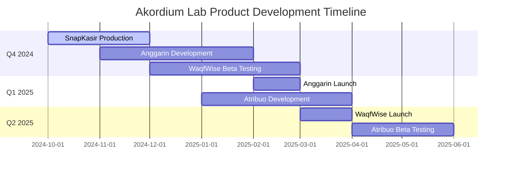
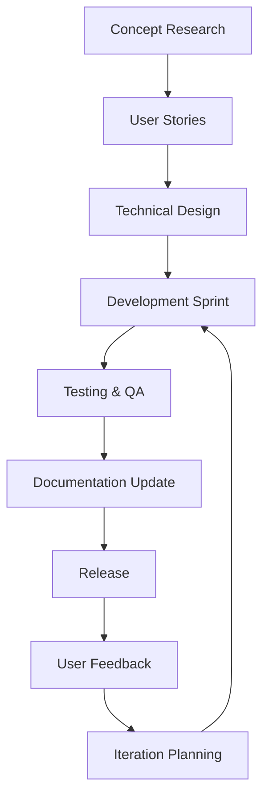

# 📚 Akordium Lab Product Index

> Navigasi cepat ke semua produk dan dokumentasi Akordium Lab

## 🚀 Quick Navigation

### 📱 Produk Aktif

| Produk | Status | Kategori | Quick Links |
|--------|--------|----------|-------------|
| [**SnapKasir**](./SnapKasir/) | 🚀 Production | Retail Technology | [README](./SnapKasir/README.md) • [Roadmap](./SnapKasir/roadmap.md) • [Tech Stack](./SnapKasir/tech-stack.md) |
| [**Anggarin**](./Anggarin/) | 🚀 Development | Personal Finance | [README](./Anggarin/README.md) • [Roadmap](./Anggarin/roadmap.md) • [User Stories](./Anggarin/user-stories.md) |
| [**WaqfWise**](./WaqfWise/) | 🥈 Beta | Islamic Fintech | [README](./WaqfWise/README.md) • [Roadmap](./WaqfWise/roadmap.md) • [Tech Stack](./WaqfWise/tech-stack.md) |
| [**Atribuo**](./Atribuo/) | 🥚 Concept | Gamification | [README](./Atribuo/README.md) • [Roadmap](./Atribuo/roadmap.md) • [User Stories](./Atribuo/user-stories.md) |
| [**Katauser**](./Katauser/) | 🥚 Concept | SaaS Tools | [README](./Katauser/README.md) • [Roadmap](./Katauser/roadmap.md) • [Product Spec](./Katauser/product-spec.md) |
| [**Klustera**](./Klustera/) | 🥚 Concept | Property Tech | [README](./Klustera/README.md) • [Roadmap](./Klustera/roadmap.md) • [Pricing Model](./Klustera/pricing-model.md) |

## 📊 Portfolio Overview

### Development Progress

### Technology Stack Summary

| Technology | Usage | Products | Benefits |
|------------|-------|----------|----------|
| **Go 1.21+** | Backend | SnapKasir, Atribuo, Katauser | Performance, Concurrency, Simplicity |
| **Laravel 10** | Backend | WaqfWise, Klustera | Rapid Development, Ecosystem, Team Expertise |
| **Next.js 14** | Frontend | SnapKasir, Anggarin, Atribuo | Performance, Developer Experience, SEO |
| **Livewire 3** | Frontend | WaqfWise, Klustera | Full-stack Reactive, No Node.js Needed |
| **Tanstack Start** | Frontend | Katauser | Type Safety, Modularity, Future-Proof |
| **PostgreSQL 15** | Database | All | Reliability, Features, Ecosystem |
| **React Native** | Mobile | SnapKasir | Code Reuse, Performance, Ecosystem |
| **Docker** | Containerization | All | Consistency, Portability, Scalability |
| **Oracle Cloud** | Infrastructure | All | Cost-effective, Indonesia-friendly |

## 🎯 Product Details

### 💚 WaqfWise - Islamic Endowment Management

**Focus:** Digitalization of waqf management untuk Islamic institutions
**Target:** 500M+ Muslim population, 10K+ Islamic institutions
**Key Features:** Sharia compliance, Blockchain transparency, Donor management

📂 **Dokumen Lengkap:**

- [📖 README](./WaqfWise/README.md) - Product overview dan tech stack
- [🗺️ Roadmap](./WaqfWise/roadmap.md) - 4-phase development plan
- [📋 User Stories](./WaqfWise/user-stories.md) - Personas dan requirements
- [⚙️ Tech Stack](./WaqfWise/tech-stack.md) - Technical architecture
- [📝 Changelog](./WaqfWise/changelog.md) - Version history
- [🐛 Known Issues](./WaqfWise/known-issues.md) - Issue tracking

### 💰 Anggarin - Personal Finance Planning

**Focus:** AI-powered personal finance management untuk millennials
**Target:** 70M+ millennials, financial inclusion goal
**Key Features:** Budget tracking, Investment insights, Financial education

📂 **Dokumen Lengkap:**

- [📖 README](./Anggarin/README.md) - Product overview dan business model
- [🗺️ Roadmap](./Anggarin/roadmap.md) - Market expansion roadmap
- [📋 User Stories](./Anggarin/user-stories.md) - Target personas dan needs
- [⚙️ Tech Stack](./Anggarin/tech-stack.md) - Technical implementation
- [📝 Changelog](./Anggarin/changelog.md) - Release history
- [🐛 Known Issues](./Anggarin/known-issues.md) - Known limitations

### ⚔️ Atribuo - Skill Visualization Gamification

**Focus:** RPG-style skill visualization untuk personal development
**Target:** 50M+ gamers, students, young professionals
**Key Features:** Hexagon charts, Social sharing, Achievement system

📂 **Dokumen Lengkap:**

- [📖 README](./Atribuo/README.md) - Product concept dan features
- [🗺️ Roadmap](./Atribuo/roadmap.md) - Gamification strategy
- [📋 User Stories](./Atribuo/user-stories.md) - Gaming personas dan stories
- [⚙️ Tech Stack](./Atribuo/tech-stack.md) - Visualization technology
- [📝 Changelog](./Atribuo/changelog.md) - Development milestones
- [🐛 Known Issues](./Atribuo/known-issues.md) - Technical challenges

### 🛒 SnapKasir - Modern POS for SMEs

**Focus:** Affordable, modern Point of Sale solution untuk UMKM
**Target:** 64M+ SMEs, digital transformation focus
**Key Features:** Multi-payment, Inventory management, Mobile apps, Analytics

📂 **Dokumen Lengkap:**

- [📖 README](./SnapKasir/README.md) - Complete product overview
- [🗺️ Roadmap](./SnapKasir/roadmap.md) - Market leadership strategy
- [📋 User Stories](./SnapKasir/user-stories.md) - UMKM personas dan needs
- [⚙️ Tech Stack](./SnapKasir/tech-stack.md) - Hardware integration
- [📝 Changelog](./SnapKasir/changelog.md) - Production releases
- [🐛 Known Issues](./SnapKasir/known-issues.md) - Issue resolution

### 💬 Katauser - Feedback Management Platform

**Focus:** Affordable feedback management untuk SaaS Indonesia
**Target:** Indonesian SaaS companies, digital agencies, startups
**Key Features:** Public feedback boards, Voting system, Roadmap sync, Changelog generator, Telegram Bot integration

📂 **Dokumen Lengkap:**

- [📖 README](./Katauser/README.md) - Product overview dan tech stack
- [📋 Product Spec](./Katauser/product-spec.md) - Fitur dan monetisasi
- [🗺️ Roadmap](./Katauser/roadmap.md) - 10-milestone development plan
- [👥 User Stories](./Katauser/user-stories.md) - Personas dan requirements
- [⚙️ Tech Stack](./Katauser/tech-stack.md) - Technical architecture
- [📝 Changelog](./Katauser/changelog.md) - Version history
- [🐛 Known Issues](./Katauser/known-issues.md) - Risk assessment dan limitations

### 🏘️ Klustera - Housing Management Platform

**Focus:** All-in-one housing management untuk Indonesian residential complexes
**Target:** 10,000+ modern housing complexes, developers perumahan, pengelola kompleks
**Key Features:** Financial management (iuran & tagihan), Resident portal, Complaint tracking, Facility booking, Per-unit pricing

📂 **Dokumen Lengkap:**

- [📖 README](./Klustera/README.md) - Product overview dan tech stack
- [📋 Product Spec](./Klustera/product-spec.md) - Fitur dan business model
- [🗺️ Roadmap](./Klustera/roadmap.md) - 10-milestone development plan
- [👥 User Stories](./Klustera/user-stories.md) - Personas dan requirements
- [⚙️ Tech Stack](./Klustera/tech-stack.md) - TALL Stack architecture
- [💰 Pricing Model](./Klustera/pricing-model.md) - Per-unit pricing strategy
- [📝 Changelog](./Klustera/changelog.md) - Version history
- [🐛 Known Issues](./Klustera/known-issues.md) - Risk assessment dan limitations

## 📈 Key Metrics Dashboard

### Current Status (December 2024)

| Metric | SnapKasir | Anggarin | WaqfWise | Atribuo | Katauser | Klustera |
|--------|-----------|----------|----------|---------|----------|----------|
| **Development** | 90% | 60% | 70% | 10% | 0% | 0% |
| **Market Ready** | ✅ Production | 🚧 Beta | 🚧 Beta | 🥈 Concept | 🥈 Concept | 🥈 Concept |
| **Team Size** | 8 developers | 6 developers | 5 developers | 3 developers | 1 developer | 1 developer |
| **Target Users** | 10K+ stores | 100K+ users | 50K+ institutions | 500K+ users | 5K+ users | 10K+ complexes |
| **Revenue Model** | SaaS + Fees | Freemium | Freemium | Freemium | Freemium | Per-Unit Pricing |

### 2025 Targets

| Metric | Q1 2025 | Q2 2025 | Q3 2025 | Q4 2025 |
|--------|---------|---------|---------|---------|
| **Total MAU** | 50K+ | 200K+ | 500K+ | 1M+ |
| **Revenue** | IDR 100M | IDR 500M | IDR 2B | IDR 5B |
| **Team Size** | 30+ | 35+ | 40+ | 50+ |
| **Products** | 5 active | 5 scaling | 5 integrated | 5 expanding |

## 🔄 Development Standards

### Documentation Standards

All product documentation follows standardized format:

- **README.md:** Product overview, tech stack, quick start
- **roadmap.md:** Strategic planning, timelines, milestones
- **user-stories.md:** User research, personas, requirements
- **tech-stack.md:** Technical architecture, implementation details
- **changelog.md:** Version history, release notes
- **known-issues.md:** Bug tracking, limitations, resolutions

### Development Workflow

### Quality Gates

- **Code Coverage:** Minimum 85% test coverage
- **Documentation:** Complete technical dan user documentation
- **Security:** Security review dan compliance check
- **Performance:** Performance benchmarking
- **User Testing:** Real user validation sebelum launch

## 🏆 Competitive Landscape

### Market Positioning

| Product Category | Our Solution | Key Differentiator |
|------------------|--------------|-------------------|
| **Retail POS** | SnapKasir | Indonesia-focused, affordable, mobile-first |
| **Personal Finance** | Anggarin | AI-powered insights, millennials focus |
| **Islamic Fintech** | WaqfWise | Sharia compliance, blockchain transparency |
| **Personal Gamification** | Atribuo | RPG-style visualization, social features |
| **Feedback Management** | Katauser | Affordable (Rp 299k vs UserJot $15-79), Telegram integration, Bahasa Indonesia |
| **Housing Management** | Klustera | Per-unit pricing (Rp 2-5K/unit), Open Source, TALL Stack, Bahasa Indonesia |

### Technology Advantages

- **Modern Stack:** Go + Next.js + Laravel + PostgreSQL
- **Cloud-Native:** Scalable, reliable architecture
- **API-First:** Easy integration dan ecosystem building
- **Mobile-First:** Responsive design dan native apps
- **Indonesia-Ready:** Local compliance dan market understanding

## 🚀 Future Roadmap

### 2025 Strategic Priorities

1. **Scale SnapKasir** - Market leadership dalam Indonesian POS
2. **Launch Anggarin** - Personal finance market entry
3. **Complete WaqfWise** - Islamic fintech leadership
4. **Validate Atribuo** - Gamification market testing
5. **Develop Katauser** - Feedback management platform for Indonesian SaaS
6. **Validate Klustera** - Housing management market entry (Q2-Q3 2025)

### 2026 Expansion Plans

- **Regional Expansion** - Southeast Asia market entry
- **Enterprise Solutions** - B2B product lines
- **API Platform** - Third-party developer ecosystem
- **Data Analytics** - Business intelligence services

## 📞 Contact Information

### Company Contacts

- **Main Office:** Jakarta, Indonesia
- **Email:** info@akordium.com
- **Website:** https://akordium.com
- **Team:** 25+ professionals

### Product Support

- **SnapKasir:** support@snapkasir.com | +62 812-3456-7890
- **Anggarin:** support@anggarin.com
- **WaqfWise:** support@waqfwise.com
- **Atribuo:** support@atribuo.com
- **Katauser:** support@katauser.com
- **Klustera:** support@klustera.id | +62 815-9988-995

### Developer Resources

- **API Documentation:** https://docs.akordium.com
- **GitHub:** https://github.com/akordium
- **Status Page:** https://status.akordium.com
- **Blog:** https://blog.akordium.com

---

**Quick Links:**

- [📖 Main README](./README.md) - Company overview
- [🏗️ _Templates/](./_templates/) - Documentation templates
- [📚 Individual Products](#--produk-aktif) - Detailed product information

**Last Updated:** 2026-01-06
**Document Version:** 1.1
**Review Cycle:** Monthly updates
