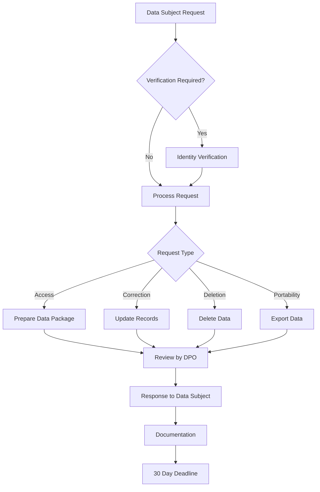

# 🛡️ Panduan Perlindungan Data & Kepatuhan GDPR

**Data Protection & GDPR Compliance Guidelines**

**Tanggal Efektif:** 1 Januari 2024
**Versi:** 1.2
**Status:** Aktif
**Review Period:** Setiap 6 bulan

---

## 📋 Pendahuluan

### **Tentang Panduan Ini**

Panduan ini memberikan kerangka kerja komprehensif untuk perlindungan data pribadi di Akordium Lab, mematuhi peraturan Indonesia (UU ITE, UU PDP) dan General Data Protection Regulation (GDPR) Uni Eropa.

### **Tujuan Panduan:**

- Memastikan compliance dengan data protection laws
- Melindungi data pribadi customers, employees, dan stakeholders
- Menetapkan prosedur yang konsisten untuk data handling
- Membangun trust dengan customers dan partners
- Menghindari financial penalties dan reputational damage

### **Scope:**

Panduan ini berlaku untuk:

- Semua data pribadi yang diproses oleh Akordium Lab
- Semua employees, contractors, dan agents
- Semua produk, services, dan business processes
- Third-party processors dan vendors
- International data transfers

---

## 🏛️ Kerangka Regulatori

### **Regulasi Indonesia:**

#### **UU ITE (Undang-Undang Informasi dan Transaksi Elektronik)**

- **Pasal 26:** Perlindungan data pribadi elektronik
- **Consent Requirements:** Explicit consent untuk data collection
- **Data Integrity:** Integrity dan confidentiality requirements
- **Cross-border Transfer:** Restrictions untuk international transfers

#### **UU PDP (Undang-Undang Perlindungan Data Pribadi)**

- **Data Controller Responsibilities:** Clear obligations untuk data controllers
- **Data Subject Rights:** Comprehensive rights untuk individuals
- **Data Breach Notifications:** Mandatory notification requirements
- **Enforcement:** Significant penalties untuk non-compliance

#### **Peraturan Pelaksana:**

- **Pemerintah Peraturan (PP):** Detailed implementation rules
- **Peraturan Menteri:** Sector-specific requirements
- **Standar Nasional:** Technical standards dan guidelines

### **International Regulations:**

#### **GDPR (General Data Protection Regulation)**

- **Territorial Scope:** Applies untuk EU residents data
- **Principles:** Lawfulness, fairness, transparency, purpose limitation
- **Rights:** Access, rectification, erasure, portability
- **Fines:** Up to 4% dari global annual revenue atau €20 million

#### **Other Frameworks:**

- **CCPA (California Consumer Privacy Act):** US privacy regulation
- **PDPA (Personal Data Protection Act):** Singapore regulations
- **LGPD (Lei Geral de Proteção de Dados):** Brazilian regulation

---

## 👤 Role dan Responsibilities

### **Senior Management:**

- **Accountability:** Overall accountability untuk data protection
- **Resource Allocation:** Resources untuk data protection initiatives
- **Culture Building:** Building privacy-focused culture
- **Strategic Oversight:** Strategic oversight dari compliance program

### **Data Protection Officer (DPO):**

- **Compliance Monitoring:** Monitoring compliance dengan regulations
- **Advice dan Guidance:** Advice kepada management dan employees
- **Regulatory Liaison:** Point of contact untuk regulatory authorities
- **Training Coordination:** Coordinating privacy training programs

### **IT Department:**

- **Technical Security:** Implementation dari technical security measures
- **Data Encryption:** Encryption untuk data in transit dan at rest
- **Access Control:** Implement access control mechanisms
- **System Monitoring:** Monitoring untuk security incidents

### **Legal Department:**

- **Contract Review:** Review contracts untuk data protection clauses
- **Regulatory Monitoring:** Monitoring regulatory developments
- **Incident Response:** Legal guidance untuk data breaches
- **Compliance Documentation:** Maintaining compliance documentation

### **HR Department:**

- **Employee Data:** Protection untuk employee data
- **Training Coordination:** Privacy training untuk employees
- **Access Management:** Employee access management
- **Background Checks:** Proper screening untuk data handling roles

---

## 🗂️ Data Classification Framework

### **Classification Levels:**

#### **Public Data:**

- **Definition:** Information yang intentionally tersedia untuk public
- **Examples:** Published company information, marketing materials
- **Protection Level:** Minimal protection requirements
- **Access Restrictions:** No access restrictions

#### **Internal Data:**

- **Definition:** Information untuk internal company use
- **Examples:** Internal policies, procedures, employee directories
- **Protection Level:** Basic protection measures
- **Access Restrictions:** Employee access only

#### **Confidential Data:**

- **Definition:** Sensitive business information
- **Examples:** Financial data, customer lists, strategic plans
- **Protection Level:** Enhanced protection measures
- **Access Restrictions:** Need-to-know basis

#### **Restricted/Highly Confidential Data:**

- **Definition:** Most sensitive information
- **Examples:** Personal data, trade secrets, system credentials
- **Protection Level:** Maximum protection measures
- **Access Restrictions:** Strictly controlled access

### **Data Handling Requirements:**

| Data Type | Storage | Transmission | Access Control | Retention |
|-----------|---------|--------------|----------------|-----------|
| Public | Standard | Standard | Public | 5 years |
| Internal | Encrypted | Encrypted | Employee auth | 7 years |
| Confidential | Encrypted | Encrypted | Role-based | 10 years |
| Restricted | Encrypted | Encrypted | Multi-factor | Legal requirement |

---

## 🔒 Security Measures dan Controls

### **Technical Controls:**

#### **Encryption Standards:**

- **Data in Transit:** TLS 1.3 atau yang lebih tinggi
- **Data at Rest:** AES-256 encryption
- **Database Encryption:** Column-level encryption untuk sensitive fields
- **Key Management:** Secure key rotation dan management

#### **Access Control:**

- **Authentication:** Strong password policies
- **Multi-Factor Authentication (MFA):** Required untuk critical systems
- **Role-Based Access Control (RBAC):** Principle of least privilege
- **Session Management:** Secure session handling

#### **Network Security:**

- **Firewalls:** Next-generation firewalls dengan deep packet inspection
- **Intrusion Detection/Prevention:** Real-time monitoring
- **VPN:** Secure remote access
- **Network Segmentation:** Isolated network zones

#### **Endpoint Security:**

- **Device Encryption:** Full disk encryption untuk laptops
- **Antivirus/Malware Protection:** Current antivirus definitions
- **Patch Management:** Regular security patches
- **Device Management:** Mobile device management (MDM)

### **Administrative Controls:**

#### **Policies dan Procedures:**

- **Data Protection Policy:** Formal documented policy
- **Incident Response Plan:** Structured response procedures
- **Business Continuity Plan:** Data recovery procedures
- **Acceptable Use Policy:** Guidelines untuk data usage

#### **Training dan Awareness:**

- **Mandatory Training:** Initial dan annual privacy training
- **Role-Based Training:** Advanced training untuk data handlers
- **Security Awareness:** Regular security awareness programs
- **Phishing Simulations:** Regular phishing awareness tests

---

## 📊 Data Processing Activities

### **Processing Register (Inventory):**

| Processing Activity | Data Categories | Legal Basis | Data Subjects | Retention | Security Measures |
|---------------------|----------------|--------------|--------------|-----------|------------------|
| Customer Onboarding | Name, email, phone | Contract | Customers | 7 years | Encryption, access control |
| Employee Management | Personal, financial | Legal | Employees | 10 years | Secure storage, limited access |
| Marketing Analytics | Behavior, preferences | Consent | Website visitors | 2 years | Anonymization, purpose limitation |
| Project Management | Contact, requirements | Contract | Clients | 10 years | Project-based access |

### **Data Processing Principles:**

#### **Lawfulness, Fairness, Transparency:**

- **Legal Basis:** Clear legal basis untuk setiap processing activity
- **Privacy Notices:** Transparent privacy notices untuk data subjects
- **Fair Processing:** Fair treatment untuk all data subjects
- **Documentation:** Documentation dari processing activities

#### **Purpose Limitation:**

- **Specific Purposes:** Specify purposes saat collection
- **Compatible Processing:** Hanya process untuk compatible purposes
- **No Secondary Use:** Tidak ada secondary use tanpa consent
- **Purpose Review:** Regular review dari processing purposes

#### **Data Minimization:**

- **Necessary Data:** Hanya collect data yang necessary
- **Limited Collection:** Limit collection untuk specified purposes
- **Data Reduction:** Reduce data ke minimum yang diperlukan
- **Pseudonymization:** Use pseudonymization dimana possible

---

## 🌍 International Data Transfers

### **Transfer Mechanisms:**

#### **Adequacy Decisions:**

- **Adequate Countries:** Transfer ke countries dengan adequate protection
- **Commission Decisions:** EU Commission adequacy decisions
- **Review Process:** Regular review dari adequacy status
- **Documentation:** Documentation dari adequacy decisions

#### **Standard Contractual Clauses (SCCs):**

- **EU SCCs:** European Commission approved SCCs
- **Modernized SCCs:** Updated SCCs untuk GDPR compliance
- **Module Selection:** Appropriate modules untuk transfer type
- **Implementation:** Proper implementation dari SCC provisions

#### **Binding Corporate Rules (BCRs):**

- **Group Companies:** Untuk intra-group transfers
- **Approval Process:** Regulatory approval process
- **Compliance Framework:** Internal compliance framework
- **Auditing Requirements:** Regular audit requirements

### **Transfer Requirements:**

| Destination | Mechanism | Additional Safeguards | Documentation |
|-------------|-----------|-----------------------|----------------|
| Singapore | Adequacy | N/A | Adequacy decision reference |
| United States | SCCs | Supplementary measures | Signed SCCs |
| European Union | Adequacy | N/A | Adequacy decision reference |
| Other Countries | SCCs/BCRs | Technical measures | Transfer agreements |

---

## 📝 Data Subject Rights Implementation

### **Rights Management System:**

#### **Right to Access:**

- **Verification Process:** Identity verification procedures
- **Response Timeline:** 30 days untuk standard requests
- **Data Format:** Machine-readable format request
- **Fee Structure:** Free for reasonable requests

#### **Right to Rectification:**

- **Correction Process:** Process untuk data correction
- **Validation:** Verification dari corrected information
- **Third-party Notification:** Notification ke third parties
- **Documentation:** Documentation dari corrections

#### **Right to Erasure (Right to be Forgotten):**

- **Deletion Process:** Secure deletion procedures
- **Verification:** Identity verification sebelum deletion
- **Public Interest Consideration:** Public interest override considerations
- **Retention Requirements:** Legal retention requirements

#### **Right to Portability:**

- **Data Export:** Data dalam structured, machine-readable format
- **Common Formats:** CSV, JSON, XML formats
- **Transfer Direct:** Direct transfer ke another controller
- **Technical Feasibility:** Technical feasibility considerations

### **Request Handling Process:**

---

## 🚨 Data Breach Management

### **Breach Classification:**

#### **High Risk Breach:**

- **Impact:** Significant risk untuk rights dan freedoms
- **Examples:** Identity theft, financial loss, discrimination
- **Notification:** 72 hours ke regulatory authorities
- **Individual Notification:** Required notification ke individuals

#### **Medium Risk Breach:**

- **Impact:** Moderate risk untuk rights dan freedoms
- **Examples:** Minor financial loss, temporary inconvenience
- **Notification:** Internal notification dengan potential external
- **Risk Assessment:** Detailed risk assessment required

#### **Low Risk Breach:**

- **Impact:** Minimal impact untuk rights dan freedoms
- **Examples:** Accidental access tanpa data extraction
- **Notification:** Internal documentation required
- **Review:** Process improvement activities

### **Incident Response Plan:**

#### **Detection Phase:**

- **Monitoring Systems:** Automated monitoring untuk breach detection
- **Reporting Channels:** Multiple channels untuk breach reporting
- **Initial Assessment:** Initial impact assessment
- **Classification:** Breach classification dan prioritization

#### **Containment Phase:**

- **Immediate Actions:** Immediate containment measures
- **System Isolation:** Isolation dari affected systems
- **Evidence Preservation:** Evidence preservation untuk investigation
- **Documentation:** Detailed documentation dari containment actions

#### **Assessment Phase:**

- **Scope Determination:** Determine breach scope
- **Impact Assessment:** Assess impact pada data subjects
- **Root Cause Analysis:** Root cause analysis
- **Risk Evaluation:** Comprehensive risk evaluation

#### **Notification Phase:**

- **Regulatory Notification:** Notification ke appropriate authorities
- **Individual Notification:** Notification ke affected individuals
- **Media Notification:** Media communication jika perlu
- **Post-notification:** Ongoing communication dan updates

#### **Post-Incident Phase:**

- **Remediation:** System dan process improvements
- **Review dan Learning:** Incident review dan lessons learned
- **Policy Updates:** Policy updates berdasarkan findings
- **Training Updates:** Training updates untuk prevention

---

## 🔍 Audit dan Monitoring

### **Internal Audit Framework:**

#### **Compliance Audits:**

- **Annual Audits:** Comprehensive annual compliance audits
- **Departmental Audits:** Regular departmental audits
- **Process Audits:** Process-specific compliance audits
- **Documentation Review:** Documentation completeness review

#### **Technical Security Audits:**

- **Penetration Testing:** Regular penetration testing
- **Vulnerability Assessments:** Automated vulnerability scanning
- **Configuration Reviews:** System configuration reviews
- **Access Control Audits:** Access control verification

#### **Third-Party Audits:**

- **Processor Audits:** Processor compliance verification
- **Vendor Assessments:** Vendor security assessments
- **Contractual Compliance:** Contractual obligation verification
- **Certification Verification:** Certification status verification

### **Monitoring Framework:**

| Monitoring Type | Frequency | Responsibility | Tools/Metrics |
|-----------------|-----------|----------------|--------------|
| Data Access Logs | Real-time | IT Security | SIEM tools |
| Compliance Metrics | Monthly | DPO | Dashboard |
| Training Completion | Quarterly | HR | LMS reports |
| Incident Response | Continuous | All Departments | Ticketing system |

---

## 📚 Training dan Awareness

### **Training Curriculum:**

#### **General Privacy Awareness (All Employees):**

- **Duration:** 2 hours
- **Frequency:** Annually
- **Topics:** Privacy principles, data handling basics, reporting procedures
- **Assessment:** Quiz dengan minimum 80% passing score

#### **Privacy Foundations (Data Handlers):**

- **Duration:** 4 hours
- **Frequency:** Annually + ad-hoc
- **Topics:** Legal frameworks, data subject rights, security measures
- **Assessment:** Scenario-based evaluation

#### **Advanced Privacy (Privacy Professionals):**

- **Duration:** 16 hours
- **Frequency:** Biannually + continuous learning
- **Topics:** Advanced legal compliance, international transfers, breach management
- **Certification:** CIPP/E, CIPM, or equivalent

#### **Executive Privacy Briefing (Management):**

- **Duration:** 1 hour
- **Frequency:** Quarterly
- **Topics:** Legal risks, compliance costs, strategic implications
- **Format:** Executive briefing dengan Q&A

### **Awareness Activities:**

- **Privacy Month:** Annual privacy awareness month
- **Phishing Simulations:** Regular phishing awareness tests
- **Privacy Champions:** Privacy champions dalam departments
- **Newsletters:** Regular privacy newsletters

---

## 📋 Vendor dan Third-Party Management

### **Due Diligence Process:**

#### **Pre-Contract Assessment:**

- **Security Assessment:** Security posture evaluation
- **Privacy Review:** Privacy practices review
- **Compliance Verification:** Regulatory compliance verification
- **Financial Review:** Financial stability assessment

#### **Contractual Requirements:**

- **Data Processing Agreements:** Comprehensive DPAs
- **Security Standards:** Minimum security standards
- **Audit Rights:** Right to audit dan verify compliance
- **Breach Notification:** Mandatory breach notification

#### **Ongoing Monitoring:**

- **Regular Assessments:** Regular compliance assessments
- **Security Reviews:** Periodic security reviews
- **Performance Monitoring:** Service level monitoring
- **Risk Assessment:** Ongoing risk assessment

### **Risk-Based Approach:**

| Vendor Risk Level | Due Diligence | Contract Requirements | Monitoring Frequency |
|------------------|--------------|----------------------|--------------------|
| High (Data Processor) | Comprehensive assessment | Full DPA, audit rights | Quarterly |
| Medium (System Access) | Standard assessment | Security clauses | Semi-annually |
| Low (No Data Access) | Basic assessment | Basic security terms | Annually |

---

## 📊 Compliance Metrics dan KPIs

### **Compliance KPIs:**

#### **Process Metrics:**

- **Training Completion:** >95% employee training completion
- **Request Response Time:** <30 days untuk data subject requests
- **Incident Response Time:** <72 hours untuk breach notification
- **Audit Findings:** Zero high findings dalam audits

#### **Security Metrics:**

- **Access Review Completion:** 100% access review completion
- **Vulnerability Remediation:** <30 days untuk critical vulnerabilities
- **Security Incident Rate:** <1 incident per quarter
- **System Uptime:** >99.5% system availability

#### **Operational Metrics:**

- **Data Inventory Accuracy:** 100% data inventory completeness
- **Contract Coverage:** 100% vendor coverage dengan DPAs
- **Policy Review Compliance:** 100% policy review compliance
- **Documentation Completeness:** 100% required documentation maintained

### **Dashboard Reporting:**

#### **Executive Dashboard:**

- **Overall Compliance Score:** Weighted compliance score
- **Risk Level:** Current risk level assessment
- **Incident Status:** Active incident status
- **Trend Analysis:** Compliance trend analysis

#### **Operational Dashboard:**

- **Request Metrics:** Data subject request metrics
- **Training Status:** Employee training status
- **Audit Status:** Audit finding status
- **Remediation Progress:** Remediation task progress

---

## 🔄 Continuous Improvement

### **Improvement Cycle:**

#### **Plan:**

- **Gap Analysis:** Identify compliance gaps
- **Risk Assessment:** Assess current risks
- **Objective Setting:** Set improvement objectives
- **Resource Planning:** Plan resources untuk improvement

#### **Do:**

- **Implementation:** Implement improvement initiatives
- **Training:** Conduct training programs
- **Communication:** Communicate changes
- **Documentation:** Document processes

#### **Check:**

- **Monitoring:** Monitor effectiveness
- **Auditing:** Conduct compliance audits
- **Metrics Review:** Review KPI performance
- **Stakeholder Feedback:** Gather stakeholder feedback

#### **Act:**

- **Corrective Actions:** Implement corrective actions
- **Process Updates:** Update processes dan procedures
- **Training Updates:** Update training programs
- **Continuous Learning:** Share best practices

### **Review Schedule:**

| Review Type | Frequency | Responsibility | Output |
|------------|-----------|----------------|--------|
| Policy Review | Annual | DPO | Updated policies |
| Risk Assessment | Quarterly | Management | Risk register |
| Technology Review | Semi-annually | IT | Technology roadmap |
| Regulatory Update | Ongoing | Legal | Compliance updates |

---

## 📞 Contact dan Resources

### **Data Protection Office (DPO):**

- **DPO:** [Nama DPO]
- **Email:** dpo@akordium.id
- **Phone:** [Nomor Telepon DPO]
- **Office Hours:** Senin - Jumat, 09:00 - 17:00 WIB

### **Privacy Help Desk:**

- **Email:** privacy@akordium.id
- **Ticket System:** [Link ke ticketing system]
- **Response Time:** 24 business hours
- **Emergency Contact:** [Emergency contact number]

### **External Resources:**

- **Kominfo:** https://www.kominfo.go.id
- **PDP Supervisory Authority:** [Relevant authority contact]
- **GDPR Guidelines:** https://gdpr.eu
- **Industry Associations:** [Industry association links]

---

## 📋 Templates dan Checklists

### **Checklist Sections:**

- Data Processing Assessment Checklist
- DPIA (Data Protection Impact Assessment) Template
- Data Breach Response Checklist
- Vendor Due Diligence Checklist
- Training Completion Checklist
- Audit Preparation Checklist

*(Templates dan checklists disediakan sebagai separate documents)*

---

**Document Version:** 1.2
**Last Updated:** 1 Januari 2024
**Next Review:** 1 Juli 2024
**Approved by:** Data Protection Officer
**Distribution:** All employees, contractors, and relevant third parties

> ⚠️ **Important Note:** This is a comprehensive template that should be customized based on your specific organizational needs, jurisdiction requirements, and business context. Regular updates and reviews are essential to maintain effectiveness and compliance with evolving regulations.
