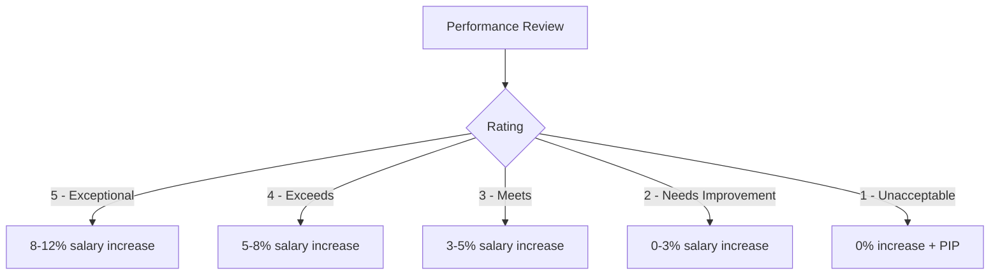

# 💰 Struktur Kompensasi

**Comprehensive Compensation Framework**

**Tanggal Efektif:** 1 Januari 2024
**Versi:** 1.0
**Status:** Aktif
**Disetujui oleh:** CEO & HR Manager

---

## 📊 Panduan Kompensasi

### **Prinsip Kompensasi:**

1. **Competitive:** Kompetitif dengan pasar startup teknologi
2. **Equitable:** Adil dan transparan untuk semua level
3. **Performance-Based:** Terkait dengan kontribusi dan hasil
4. **Growth-Oriented:** Mendukung pengembangan karir
5. **Sustainable:** Sesuai dengan kemampuan perusahaan

### **Total Compensation Philosophy:**

- **Base Salary:** 60-70% dari total kompensasi
- **Variable Pay:** 15-20% (bonus, komisi, insentif)
- **Benefits:** 15-25% (asuransi, tunjangan, fasilitas)
- **Equity:** 0-15% (tergantung level dan kontribusi)

---

## 💵 Salary Bands & Job Levels

### **Engineering Roles**

#### **Junior Developer (Level 1)**

| Experience | Base Salary/Bulan | Grade | Target Bonus |
|------------|------------------|-------|--------------|
| 0-1 tahun  | Rp 6-8 Juta      | E1.1  | 1x gaji      |
| 1-2 tahun  | Rp 7-9 Juta      | E1.2  | 1.2x gaji    |

#### **Mid-Level Developer (Level 2)**

| Experience | Base Salary/Bulan | Grade | Target Bonus |
|------------|------------------|-------|--------------|
| 2-3 tahun  | Rp 9-12 Juta     | E2.1  | 1.5x gaji    |
| 3-4 tahun  | Rp 11-15 Juta    | E2.2  | 1.8x gaji    |

#### **Senior Developer (Level 3)**

| Experience | Base Salary/Bulan | Grade | Target Bonus |
|------------|------------------|-------|--------------|
| 4-6 tahun  | Rp 15-20 Juta    | E3.1  | 2x gaji      |
| 6+ tahun   | Rp 18-25 Juta    | E3.2  | 2.5x gaji    |

#### **Lead/Principal Developer (Level 4)**

| Role | Base Salary/Bulan | Grade | Target Bonus |
|------|------------------|-------|--------------|
| Team Lead | Rp 20-30 Juta | E4.1 | 2.5-3x gaji |
| Principal | Rp 28-40 Juta | E4.2 | 3-4x gaji |

### **Non-Engineering Roles**

#### **Product & Design**

| Role | Level | Base Salary/Bulan | Target Bonus |
|------|-------|------------------|--------------|
| Jr. Product Designer | P1 | Rp 7-10 Juta | 1.2x gaji |
| Product Designer | P2 | Rp 10-15 Juta | 1.5x gaji |
| Sr. Product Designer | P3 | Rp 15-22 Juta | 2x gaji |
| Product Manager | P3 | Rp 18-25 Juta | 2x gaji |

#### **Business & Operations**

| Role | Level | Base Salary/Bulan | Target Bonus |
|------|-------|------------------|--------------|
| Jr. Business Dev | B1 | Rp 6-9 Juta | 1.5x gaji (komisi) |
| Business Dev | B2 | Rp 9-14 Juta | 2x gaji (komisi) |
| Sr. Business Dev | B3 | Rp 14-20 Juta | 2.5x gaji (komisi) |

#### **Leadership**

| Role | Level | Base Salary/Bulan | Target Bonus | Equity |
|------|-------|------------------|--------------|--------|
| Engineering Manager | M1 | Rp 25-35 Juta | 3x gaji | 0.5-1% |
| Head of Product | M2 | Rp 30-45 Juta | 3.5x gaji | 0.8-1.5% |
| CTO | M3 | Rp 40-60 Juta | 4x gaji | 1.5-3% |

---

## 🎁 Benefits Package

### **Core Benefits (Semua Karyawan)**

#### **Health Insurance:**

- **BPJS Kesehatan:** Full coverage untuk kelas 1
- **Asuransi Swasta:** Rawat inap (kamar VIP), rawat jalan, gigi
- **Family Coverage:** Pasangan dan maksimal 2 anak
- **Annual Checkup:** Rp 2 Juta/tahun

#### **Life Insurance:**

- **BPJS Jamsostek:** Sesuai ketentuan pemerintah
- **Asuransi Tambahan:** 10x gaji pokok
- **Accident Coverage:** Rp 500 Juta

#### **Leave Entitlements:**

```text
Annual Leave: 12 hari (akumulasi max 24 hari)
Sick Leave: Sesuai dokter (max 12 hari/tahun)
Maternity Leave: 3 bulan (sesuai UU)
Paternity Leave: 2 hari
Marriage Leave: 2 hari
Compassionate Leave: 2 hari
```

### **Performance-Based Benefits**

#### **Professional Development:**

- **Training Budget:** Rp 10 Juta/tahun (Level 3+)
- **Training Budget:** Rp 5 Juta/tahun (Level 1-2)
- **Conference Budget:** Rp 7 Juta/tahun (Level 3+)
- **Book Stipend:** Rp 500 Ribu/bulan
- **Online Courses:** Unlimited access (platform premium)

#### **Work-Life Benefits:**

- **Flexible Working Hours:** Core hours 10:00-15:00
- **Remote Work:** 2 hari/minggu (subject to role)
- **Unlimited Sick Leave:** With doctor's note
- **Mental Health Support:** Counseling sessions
- **Gym Membership:** Rp 500 Ribu/bulan

### **Additional Benefits (Level 2+)**

#### **Financial Benefits:**

- **Transport Allowance:** Rp 1 Juta/bulan
- **Meal Allowance:** Rp 800 Ribu/hari kerja
- **Phone & Internet:** Rp 500 Ribu/bulan
- **Home Office Setup:** One-time Rp 10 Juta
- **Parking Reimbursement:** Full coverage

#### **Health & Wellness:**

- **Extended Dental:** Rp 5 Juta/tahun
- **Vision Care:** Rp 2 Juta/tahun
- **Alternative Medicine:** Rp 3 Juta/tahun
- **Family Health Checkup:** Rp 3 Juta/tahun

### **Leadership Benefits (Level 4+ & Management)**

#### **Premium Benefits:**

- **Executive Health:** Annual comprehensive checkup
- **Spa & Wellness:** Rp 1 Juta/bulan
- **Personal Trainer:** Rp 2 Juta/bulan
- **Financial Advisory:** Quarterly consultation
- **Legal Advisory:** Personal legal services

#### **Travel & Lifestyle:**

- **Business Class:** Flights >3 hours
- **Hotel Premium:** 5-star accommodation
- **Travel Allowance:** Rp 2 Juta/bulan
- **Family Vacation:** Rp 15 Juta/tahun

---

## 🎯 Bonus & Incentive Structure

### **Individual Performance Bonus**

#### **Calculation Formula:**

```javascript
const bonusCalculation = {
  baseSalary: monthlySalary,
  performanceMultiplier: ratingMultiplier, // 1.0 - 2.0
  companyMultiplier: companyPerformance,   // 0.5 - 1.5
  teamMultiplier: teamPerformance,         // 0.8 - 1.2

  quarterlyBonus: baseSalary * performanceMultiplier * 0.25,
  annualBonus: baseSalary * performanceMultiplier * companyMultiplier
}
```

#### **Performance Rating Multipliers:**

| Rating | Description | Multiplier |
|--------|-------------|------------|
| 5 - Exceptional | Far exceeds expectations | 2.0x |
| 4 - Exceeds | Exceeds expectations | 1.5x |
| 3 - Meets | Meets expectations | 1.0x |
| 2 - Needs Improvement | Below expectations | 0.5x |
| 1 - Unacceptable | Well below expectations | 0x |

### **Team & Company Bonus**

#### **Team Performance Bonus:**

- **Project Completion:** Rp 2-10 Juta per project
- **Client Satisfaction:** 5-15% dari project value
- **Innovation Award:** Rp 5-20 Juta per achievement

#### **Company Performance Bonus:**

- **Revenue Target:** 0.5-2x gaji berdasarkan pencapaian
- **Profit Sharing:** 10-20% dari profit bonus pool
- **Stock Options:** Grant annual untuk top performers

### **Special Bonuses**

#### **Referral Bonus:**

| Role | Bonus Amount | Terms |
|------|--------------|-------|
| Developer | Rp 5 Juta | Pass probation |
| Senior Developer | Rp 7.5 Juta | 6 months tenure |
| Manager | Rp 10 Juta | 1 year tenure |

#### **Spot Bonus:**

- **Above & Beyond:** Rp 500 Ribu - 2 Juta
- **Innovation:** Rp 1 Juta - 5 Juta
- **Customer Excellence:** Rp 500 Ribu - 3 Juta
- **Team Spirit:** Rp 500 Ribu - 1 Juta

---

## 📈 Equity & ESOP

### **Stock Option Plan**

#### **Eligibility:**

- **Minimum Tenure:** 1 tahun
- **Performance Rating:** Minimum 3.0
- **Employment Status:** Full-time
- **Company Approval:** Management & Board

#### **Vesting Schedule:**

```text
Total Grant: 4-year vesting period
Cliff Period: 1 year (25% vest)
Monthly Vesting: 1/48 per month after cliff
Acceleration: Single trigger on acquisition
Early Exercise: Available for key employees
```

#### **Option Grants by Level:**

| Level | Shares | Vesting Period | Strike Price |
|-------|--------|----------------|--------------|
| Junior Developer | 1,000-2,500 | 4 years | FMV |
| Mid-Level Developer | 2,500-5,000 | 4 years | 10% discount |
| Senior Developer | 5,000-10,000 | 4 years | 15% discount |
| Lead/Principal | 10,000-25,000 | 4 years | 20% discount |
| Management | 25,000-100,000 | 4 years | 30% discount |

### **Phantom Stock Plan (Alternative)**

#### **For Companies Not Ready for Equity:**

- **Virtual Shares:** Based on company valuation
- **Cash Settlement:** At exit or liquidity event
- **Performance Tied:** Revenue/profit milestones
- **No Dilution:** Fixed percentage of company

---

## 🏆 Performance-Based Compensation

### **Commission Structure (Sales & Business Dev)**

#### **Revenue-Based Commission:**

| Revenue Tier | Commission Rate | Minimum Target |
|--------------|-----------------|----------------|
| Rp 0-100 Juta/bulan | 5% | Rp 50 Juta |
| Rp 100-250 Juta/bulan | 7% | Rp 100 Juta |
| Rp 250-500 Juta/bulan | 10% | Rp 200 Juta |
| Rp 500M+ /bulan | 15% | Rp 300 Juta |

#### **Commission Multipliers:**

- **New Client:** 1.5x multiplier
- **Recurring Revenue:** 0.8x multiplier
- **Large Deal (>Rp 1 Miliar):** 1.3x multiplier
- **Strategic Account:** 1.2x multiplier

### **Project-Based Compensation**

#### **Development Team Bonus:**

| Project Type | Bonus Amount | Success Criteria |
|--------------|--------------|------------------|
| Quick Win (<1 bulan) | 2-5% project value | On-time delivery |
| Standard (1-3 bulan) | 5-10% project value | Client satisfaction |
| Complex (>3 bulan) | 8-15% project value | All metrics met |
| Innovation Project | 10-20% project value | Patent/IP created |

---

## 💡 Compensation Philosophy & Strategy

### **Market Positioning**

#### **Salary Benchmarking:**

- **Market Data:** Glassdoor, Payscale, IDC Insights
- **Market Position:** 75th percentile (above average)
- **Review Frequency:** Bi-annual salary review
- **Adjustment Factors:** Inflation, market rate, performance

#### **Industry Comparison:**

```text
Startup Tech (Series A-B): -10% to market
Established Tech Company: At market
Multinational Corporation: +15% to market
Our Position: Competitive startup package with growth potential
```

### **Transparency Framework**

#### **Communication Guidelines:**

- **Salary Ranges:** Published internally by level
- **Bonus Calculations:** Clear formulas shared openly
- **Promotion Criteria:** Documented advancement paths
- **Market Adjustments:** Regular communication on changes

#### **Confidentiality Requirements:**

- **Individual Salaries:** Strict confidentiality policy
- **Team Budgets:** Shared with team leads
- **Company Strategy:** Open communication on financial health
- **Compensation Philosophy:** Publicly shared with all employees

---

## 📋 Compensation Administration

### **Pay Schedule & Process**

#### **Monthly Payroll:**

```text
Payroll Date: 25th of each month
Cut-off Date: 20th of each month
Payment Method: Bank transfer
Tax Calculation: PPh 21 handled by company
BPJS Deductions: Automatic processing
```

#### **Bonus Payment Schedule:**

- **Q1 Performance Bonus:** April 15th
- **Q2 Performance Bonus:** July 15th
- **Q3 Performance Bonus:** October 15th
- **Q4 Performance Bonus:** January 15th
- **Annual Bonus:** March 1st (after financial year close)

### **Review & Adjustment Process**

#### **Performance-Based Reviews:**



#### **Market-Based Adjustments:**

- **Annual Market Review:** January each year
- **Inflation Adjustment:** Based on BI rate
- **Industry Changes:** Immediate response to market shifts
- **Internal Equity:** Regular pay equity audits

---

## 📊 Compensation Budget Planning

### **Total Compensation Costs**

#### **Cost Per Employee (Indirect):**

| Benefit | Cost Percentage | Annual Cost (Junior) |
|---------|----------------|---------------------|
| BPJS (Company Portion) | 7% | Rp 840 Ribu |
| Health Insurance | 5% | Rp 600 Ribu |
| Life Insurance | 2% | Rp 240 Ribu |
| Training & Development | 3% | Rp 360 Ribu |
| Equipment & Tools | 2% | Rp 240 Ribu |
| Administrative Overhead | 8% | Rp 960 Ribu |
| **Total Indirect Cost** | **27%** | **Rp 3.24 Juta/tahun** |

#### **Total Compensation Ratio:**

```javascript
const totalCompensation = {
  baseSalary: 100,
  variableBonus: 15,      // Average performance bonus
  benefits: 27,          // Indirect costs
  totalEmploymentCost: 142, // Total cost percentage

  // Junior Developer Example:
  monthlyBase: 8000000,
  estimatedAnnualBonus: 14400000, // 1.8x monthly
  annualBenefits: 3240000,
  totalAnnualCost: 144000000 // 1.42x base
}
```

### **Budget Allocation Framework**

#### **Compensation Mix by Role:**

| Role Category | Base | Variable | Benefits | Total |
|---------------|------|----------|----------|-------|
| Junior Developer | 70% | 15% | 15% | 100% |
| Mid-Level Developer | 65% | 20% | 15% | 100% |
| Senior Developer | 60% | 25% | 15% | 100% |
| Sales/Business Dev | 50% | 35% | 15% | 100% |
| Management | 55% | 30% | 15% | 100% |

---

## 🚀 Career Progression & Compensation

### **Promotion Guidelines**

#### **Typical Promotion Timeline:**

- **Junior → Mid-Level:** 18-24 months
- **Mid → Senior:** 24-36 months
- **Senior → Lead:** 36-48 months
- **Lead → Manager:** 48-60 months
- **Manager → Director:** 60+ months

#### **Promotion Salary Increase:**

| Promotion Type | Typical Increase |
|----------------|------------------|
| Junior → Mid-Level | 20-30% |
| Mid → Senior | 25-35% |
| Senior → Lead | 30-40% |
| Lead → Manager | 35-50% |
| Manager → Director | 40-60% |

### **Skill-Based Compensation**

#### **High-Demand Skills Premium:**

| Skill | Premium Amount | Eligibility |
|-------|----------------|-------------|
| Go/Golang | +15% | Certified + 2 projects |
| React/Next.js | +10% | Portfolio + 2 years |
| DevOps/K8s | +20% | Certifications + experience |
| AI/ML | +25% | Advanced degree + projects |
| Mobile Development | +15% | Published apps + 2 years |

---

## 📝 Compensation Policies & Compliance

### **Legal Compliance**

#### **Indonesian Labor Law Compliance:**

- **Minimum Wage:** Above provincial minimum wage
- **Overtime Pay:** Sesuai UU Ketenagakerjaan
- **BPJS Contributions:** Penuhi ketentuan pemerintah
- **Holiday Pay:** Sesuai ketentuan resmi
- **Severance Pay:** Sesuai masa kerja dan alasan PHK

#### **Tax Compliance:**

```text
PPh 21: Tax withholding handled by company
Final Tax: Employment tax calculation
Tax Benefits: Utilize available tax deductions
Reporting: Annual tax reporting assistance
```

### **Compensation Policy Compliance**

#### **Equal Pay Policy:**

- **Gender Pay Equity:** Equal pay for equal work
- **Age Discrimination:** No age-based compensation bias
- **Equal Opportunity:** Merit-based compensation only
- **Regular Audits:** Annual pay equity analysis

#### **Data Privacy:**

- **Confidentiality:** Individual salary data kept confidential
- **Access Control:** Limited access to compensation data
- **Data Security:** Encrypted storage of sensitive information
- **GDPR Compliance:** Data protection standards maintained

---

## 🎯 Special Compensation Programs

### **Retention Programs**

#### **Retention Bonus Structure:**

| Years of Service | Bonus Amount | Payout Schedule |
|------------------|--------------|-----------------|
| 2 years | 2x monthly salary | Lump sum |
| 3 years | 3x monthly salary | Lump sum |
| 5 years | 5x monthly salary | Lump sum |
| 10 years | 10x monthly salary | Lump sum + additional stock options |

#### **Stay Interviews & Counter Offers:**

- **Proactive Retention:** Quarterly stay interviews
- **Market Adjustment:** Competitive counter offers
- **Career Development:** Personalized development plans
- **Work-Life Balance:** Flexible arrangements for retention

### **Special Recognition Programs**

#### **Outstanding Performance Awards:**

- **Innovation Award:** Rp 10 Juta + recognition
- **Customer Excellence:** Rp 5 Juta + customer testimonial
- **Team Player Award:** Rp 3 Juta + peer recognition
- **Leadership Excellence:** Rp 15 Juta + development opportunity

#### **Project Success Rewards:**

- **Early Delivery:** 10% project bonus
- **Under Budget:** 15% cost savings shared
- **Customer Satisfaction:** 20% of client bonus
- **Technical Excellence:** Rp 2-5 Juta per achievement

---

## 📚 Resources & References

### **External Resources:**

- **Market Data:** [Glassdoor Salary](https://www.glassdoor.com/Salaries)
- **Industry Reports:** [IDC Insights](https://www.idc.com)
- **Legal Resources:** [Kementerian Ketenagakerjaan RI](https://www.kemnaker.go.id)
- **Tax Information:** [Direktorat Jenderal Pajak](https://www.pajak.go.id)

### **Internal Resources:**

- **Performance Reviews:** `/07-HR-People/performance-review.md`
- **Career Development:** `/07-HR-People/training-materials/`
- **Legal Compliance:** `/06-Legal-Compliance/`
- **Finance Administration:** `/05-Finance-Admin/`

---

## 📞 Compensation Administration

### **Contact Information:**

- **HR Manager:** [HR Manager Email]
- **Finance Director:** [Finance Director Email]
- **Compensation Committee:** Review quarterly
- **External Consultant:** [Compensation Firm Contact]

### **Appeals Process:**

1. **Informal Discussion:** With immediate manager
2. **HR Review:** Formal compensation review
3. **Compensation Committee:** Final decision
4. **External Mediation:** If needed (rare cases)

---

**Document Version:** 1.0
**Last Updated:** 1 Januari 2024
**Next Review:** 1 Juli 2024
**Maintained by:** CEO & HR Manager, PT Akordium Lab Digital

> 💡 **Compensation Success Principles:**
>
> - Compensation should motivate and retain top talent
> - Transparency builds trust and engagement
> - Regular reviews ensure market competitiveness
> - Total compensation includes more than just salary
