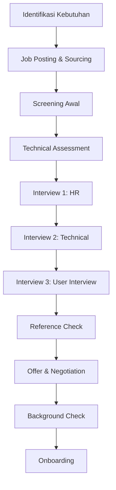

# 🔄 Flow Rekrutmen Karyawan

**Hiring Process & Recruitment Workflow**

**Tanggal Efektif:** 1 Januari 2024
**Versi:** 1.0
**Status:** Aktif
**Disetujui oleh:** HR Manager & Technical Lead

---

## 📋 Tujuan dan Scope

### **Tujuan Proses Rekrutmen:**

- Mendapatkan talent terbaik yang sesuai dengan kebutuhan perusahaan
- Menjamin proses rekrutmen yang fair, transparan, dan konsisten
- Menciptakan pengalaman positif bagi kandidat
- Mengurangi turnover rate dengan hire yang tepat
- Menjaga brand image Akordium Lab sebagai employer of choice

### **Scope:**

Proses ini berlaku untuk semua posisi:

- **Technical Roles:** Software Engineers, DevOps, QA, UI/UX Designers
- **Non-Technical Roles:** Project Managers, Sales, Marketing, Admin
- **Leadership Roles:** Team Lead, Engineering Manager, C-level
- **Contract/ Freelance:** Short-term dan long-term contracts

---

## 🗺️ Overview Proses Rekrutmen



---

## 🎯 Fase 1: Perencanaan dan Persiapan

### **1.1 Identifikasi Kebutuhan**

**Timeline:** 1-2 minggu sebelum mulai rekrutmen

#### **Trigger untuk Hiring:**

- **Growth Hiring:** Ekspansi tim untuk project baru
- **Replacement:** Karyawan keluar atau promosi
- **Upskilling:** Kebutuhan skill baru untuk teknologi tertentu
- **Strategic Hiring:** Posisi baru untuk strategic initiatives

#### **Job Analysis Worksheet:**

```markdown
## Job Analysis Form
**Position:** [Nama Posisi]
**Department:** [Nama Departemen]
**Reports to:** [Nama Atasan Langsung]
**Hiring Manager:** [Nama Hiring Manager]

### Job Requirements:
**Experience Level:** [Junior/Mid/Senior/Lead]
**Years of Experience:** [Jumlah tahun]
**Education:** [Pendidikan minimal]
**Technical Skills:** [Skill teknis wajib]
**Soft Skills:** [Soft skills yang diperlukan]
**Certifications:** [Sertifikasi yang relevan]

### Business Context:
**Project:** [Project terkait]
**Team Size:** [Ukuran tim]
**Key Responsibilities:** [3-5 tanggung jawab utama]
**Success Metrics:** [KPI untuk posisi ini]
**Career Path:** [Path pengembangan karir]

### Compensation Budget:
**Salary Range:** Rp [Min] - Rp [Max]
**Benefits:** [Benefit tambahan]
**Bonus Structure:** [Struktur bonus]
**Equity/ESOP:** [Ya/Tidak]
```

### **1.2 Persetujuan Rekrutmen**

- **Budget Approval:** Approval dari Finance & Management
- **Headcount Approval:** Approval dari Direksi
- **Job Description Finalization:** Finalisasi JD oleh Hiring Manager
- **Timeline Definition:** Set target timeline untuk proses rekrutmen

---

## 📢 Fase 2: Job Posting dan Sourcing

### **2.1 Job Description Creation**

#### **Standard JD Template:**

```markdown
# [Job Title] at Akordium Lab

## Tentang Posisi
[Keterangan singkat tentang posisi dan impact-nya]

## Tanggung Jawab Utama
1. [Responsibility 1 dengan metrics]
2. [Responsibility 2 dengan metrics]
3. [Responsibility 3 dengan metrics]

## Kualifikasi Minimum
### Technical Skills:
- [Skill 1] - [Level proficiency]
- [Skill 2] - [Level proficiency]
- [Skill 3] - [Level proficiency]

### Soft Skills:
- [Soft skill 1]
- [Soft skill 2]
- [Soft skill 3]

## Pengalaman
- [Jumlah] tahun experience di [field]
- Experience dengan [technology/methodology]
- Experience di [industry] (optional)

## What We Offer
- Competitive salary range: Rp [range]
- Flexible working arrangements
- Professional development budget
- Health insurance benefits
- Annual performance bonus
- Equity participation (untuk senior roles)

## Lokasi
[Kerja remote/onsite/hybrid dengan detail]

## Apply Process
Kirim CV dan portfolio ke careers@akordium.id dengan subject: [Subject format]
```

### **2.2 Job Posting Channels**

#### **Primary Channels:**

- **Company Website:** akordium.id/careers
- **LinkedIn:** Company page dan targeted postings
- **Job Portal:** Glints, TechInAsia, Kalibrr
- **GitHub Jobs:** Untuk technical roles
- **Internal Referrals:** Employee referral program

#### **Secondary Channels:**

- **University Career Centers:** Partner universities
- **Tech Communities:** GDG, ID DevOps, PHP Indonesia
- **Specialized Platforms:** Stack Overflow Jobs, Angellist
- **Social Media:** Instagram, Twitter, Facebook Groups

### **2.3 Proactive Sourcing**

#### **Sourcing Strategy:**

```markdown
## Sourcing Plan Template

### Target Candidates:
**Experience Level:** [Junior/Mid/Senior]
**Technical Stack:** [Go, PHP, JavaScript, etc]
**Industry Focus:** [Fintech, E-commerce, etc]
**Geographic Location:** [Jakarta, Bandung, Remote, etc]

### Sourcing Channels:
1. **LinkedIn Sourcing:** [Target keywords dan companies]
2. **GitHub Sourcing:** [Target repositories dan contributors]
3. **Community Outreach:** [Events, meetups, conferences]
4. **Employee Referrals:** [Referral bonus program]
5. **Direct Approach:** [Target specific individuals]

### Sourcing Metrics:
- **Target Candidates:** [Jumlah target]
- **Response Rate:** [% response rate yang diharapkan]
- **Conversion Rate:** [% ke interview stage]
- **Cost per Hire:** [Budget per hire]
```

---

## 🔍 Fase 3: Screening dan Assessment

### **3.1 Resume Screening**

**Timeline:** 1-3 hari per batch
**Responsibility:** HR & Hiring Manager

#### **Screening Criteria Checklist:**

- [ ] **Experience Check:** Sesuai dengan requirement minimal
- [ ] **Technical Skills:** Kemampuan teknis yang relevan
- [ ] **Education:** Background pendidikan yang sesuai
- [ ] **Project Experience:** Experience dengan project serupa
- [ ] **Cultural Fit:** Indikasi fit dengan company culture
- [ ] **Communication:** Kualitas komunikasi dalam CV
- [ ] **Portfolio/ GitHub:** Evidence dari work yang relevance

#### **Screening Scoring System:**

| Criteria | Weight | Score (1-5) | Weighted Score |
|----------|--------|--------------|--------------|
| Technical Experience | 30% | | |
| Education | 15% | | |
| Project Relevance | 25% | | |
| Communication | 15% | | |
| Portfolio Quality | 15% | | |
| **Total** | **100%** | | **[Score]** |

**Passing Score:** Minimum 3.5/5.0

### **3.2 Initial Technical Assessment**

#### **Automated Assessment (Technical Roles):**

- **Platform:** HackerRank, Codility, atau custom assessment
- **Duration:** 60-90 minutes
- **Topics:** Sesuai dengan technical requirements
- **Difficulty:** Sesuai dengan experience level

#### **Assessment Examples:**

```go
// Example Go Assessment Question
// Buat function untuk reverse linked list
type ListNode struct {
    Val  int
    Next *ListNode
}

func reverseList(head *ListNode) *ListNode {
    // Implementasikan solution di sini
}
```

#### **Non-Technical Assessment:**

- **Essay Questions:** Problem-solving scenarios
- **Case Studies:** Business problem analysis
- **Communication Test:** Email writing untuk client communication

---

## 🗣️ Fase 4: Interview Process

### **4.1 Interview Structure Overview**

| Round | Duration | Interviewers | Focus | Decision Maker |
|-------|----------|--------------|-------|----------------|
| HR Interview | 30-45 menit | HR Manager | Culture fit, salary expectations | HR |
| Technical Interview 1 | 60-90 menit | Senior Engineer | Technical depth, problem solving | Tech Lead |
| Technical Interview 2 | 60 menit | Team Lead/Architect | System design, architecture | Tech Lead |
| User/Client Interview | 45-60 menit | Project Manager | Collaboration, communication | Hiring Manager |
| Final Interview | 30-45 menit | Director/CTO | Strategic fit, leadership | Director |

### **4.2 HR Interview (Round 1)**

#### **Interview Guide:**

```markdown
## HR Interview Script

### Opening (5 menit):
- Introduction dan perkenalan
- Company overview dan culture
- Process overview dan timeline

### Background Assessment (15 menit):
- Career goals dan aspirations
- Previous experience dan achievements
- Reasons for leaving previous jobs
- Salary expectations dan negotiations

### Culture Fit Assessment (10 menit):
- Work style preferences
- Team collaboration experience
- Conflict resolution examples
- Work-life balance expectations

### Logistics (5 menit):
- Availability dan start date
- Remote work preferences
- Benefits dan compensation questions
- Next steps clarification

### Closing (5 menit):
- Candidate questions
- Process timeline communication
- Thank you dan feedback process
```

#### **Evaluation Criteria:**

- **Communication Skills:** Clarity dan confidence
- **Cultural Alignment:** Alignment dengan company values
- **Motivation:** Reason for interest in Akordium Lab
- **Professionalism:** Overall professional demeanor
- **Career Goals:** Alignment dengan growth opportunities

### **4.3 Technical Interview 1 (Round 2)**

#### **Interview Structure:**

```markdown
## Technical Interview Format

### Introduction (5 menit):
- Introduction dari interviewer
- Candidate background review
- Interview structure explanation

### Technical Deep Dive (30-40 menit):
- **Algorithm & Data Structures:** 2-3 coding problems
- **System Design:** Small scale design discussion
- **Code Review:** Code sample review dan feedback
- **Troubleshooting:** Debugging scenarios

### Project Discussion (10-15 menit):
- Previous projects discussion
- Technical challenges faced
- Solutions implemented
- Lessons learned

### Architecture Discussion (10 menit):
- System design principles
- Scalability considerations
- Best practices application
- Technology choices rationale

### Closing (5 menit):
- Candidate questions
- Next steps explanation
- Feedback timeline
```

#### **Coding Question Examples:**

```go
// Question 1: Array Manipulation
// Implement function untuk menemukan missing number dalam array
func findMissingNumber(nums []int) int {
    // Solution implementation
}

// Question 2: String Processing
// Implement function untuk validasi email address
func validateEmail(email string) bool {
    // Solution implementation
}

// Question 3: Data Structure
// Implement LRU Cache dengan capacity limit
type LRUCache struct {
    // Struct definition
}
```

### **4.4 Technical Interview 2 (Round 3)**

#### **System Design Focus:**

```markdown
## System Design Interview Topics

### Core Concepts:
- Scalability dan performance considerations
- Database design dan optimization
- API design principles
- Security implementation
- Monitoring dan observability

### Question Examples:
1. "Design a URL shortening service like bit.ly"
2. "Design a real-time chat application"
3. "Design a file upload service with large file support"
4. "Design a notification system for multi-platform delivery"

### Evaluation Criteria:
- **Problem Decomposition:** Breaking down complex problems
- **Trade-off Analysis:** Making informed technical decisions
- **Scalability Thinking:** Designing for growth
- **Communication:** Explaining technical concepts clearly
```

### **4.5 User/Client Interview (Round 4)**

#### **Interview Focus:**

- **Collaboration Skills:** Teamwork dan communication
- **Client Interaction:** Experience dengan stakeholder management
- **Project Management:** Planning dan execution capabilities
- **Problem Solving:** Real-world problem handling

#### **Sample Questions:**

- "Describe a challenging project situation dan how you handled it"
- "How do you handle conflicts with team members?"
- "Describe your experience working with non-technical stakeholders"
- "How do you prioritize tasks when facing multiple deadlines?"

### **4.6 Final Interview (Round 5)**

#### **Leadership Interview (Senior Roles):**

- **Strategic Thinking:** Business impact understanding
- **Leadership Style:** Team management approach
- **Mentoring:** Experience developing junior developers
- **Innovation:** Contribution to technology dan processes

---

## 📞 Fase 5: Reference Check

### **5.1 Reference Check Process**

#### **Reference Request Template:**

```markdown
## Professional Reference Check

**Candidate Name:** [Nama Kandidat]
**Position Applied:** [Posisi yang dilamar]
**Reference Name:** [Nama Reference]
**Company:** [Perusahaan Reference]
**Relationship:** [Manager/Colleague/Client]
**Contact:** [Email/Phone]

### Questions for Manager:
1. **Dates of Employment:** [Start date - End date]
2. **Job Title:** [Official job title]
3. **Performance Rating:** [Scale 1-10] dengan penjelasan
4. **Strengths:** Top 3 strengths
5. **Areas for Improvement:** Areas yang perlu dikembangkan
6. **Reason for Leaving:** Alasan keluar
7. **Rehire Eligibility:** Would you hire them again?

### Questions for Colleague:
1. **Collaboration Style:** Bagaimana cara kerjasama
2. **Technical Skills:** Assessment kemampuan teknis
3. **Problem Solving:** Contoh problem solving
4. **Communication:** Skill komunikasi tim
5. **Leadership:** Potensi leadership (jika applicable)
6. **Team Contribution:** Kontribusi ke tim
7. **Recommendation:** Would you recommend them?

### Additional Questions:
- **Biggest Achievement:** Achievement terbesar
- **Challenging Situation:** Situation challenging yang dihadapi
- **Learning Agility:** Kemampuan belajar hal baru
- **Cultural Fit:** Fit dengan company culture
- **Overall Recommendation:** Recommendation keseluruhan
```

### **5.2 Reference Check Guidelines**

#### **Red Flags:**

- **Negative Feedback:** Consistently negative reviews
- **Performance Issues:** Mention of performance problems
- **Behavioral Concerns:** Issues dengan attitude atau behavior
- **Inconsistencies:** Information yang tidak sesuai dengan resume
- **Hesitation:** Reluctance untuk memberikan recommendation

#### **Green Flags:**

- **Enthusiastic Recommendations:** Strong positive feedback
- **Specific Examples:** Detailed examples dengan metrics
- **Growth Mentions:** Professional development yang positif
- **Consistency:** Informasi yang konsisten
- **Rehire Willingness**: Willingness untuk rehire

---

## 💼 Fase 6: Offer dan Negotiation

### **6.1 Offer Preparation**

#### **Offer Package Template:**

```markdown
## Employment Offer Package

### Position Details:
- **Title:** [Job Title]
- **Department:** [Department]
- **Reports to:** [Manager]
- **Location:** [Remote/Office/Hybrid]
- **Start Date:** [Proposed start date]

### Compensation:
- **Base Salary:** Rp [Amount] per bulan
- **Annual Bonus:** Up to [%] dari base salary
- **Performance Review:** Annual dengan adjustment opportunity
- **Equity:** [Jumlah] RSU/ESOP (jika applicable)

### Benefits:
- **Health Insurance:** BPJS Kesehatan + private insurance
- **Life Insurance:** BPJS Ketenagakerjaan + additional
- **Annual Leave:** 12 hari kerja + [additional days]
- **Training Budget:** Rp [Amount] per tahun
- **Device Allowance:** Laptop dan equipment
- **Internet Allowance:** Rp [Amount] per bulan (untuk remote)

### Working Arrangements:
- **Working Hours:** 09:00 - 17:00 WIB
- **Flexibility:** Flexible hours dengan coordination
- **Leave Policy:** Company standard leave policy
- **Remote Work:** Remote work options

### Terms:
- **Probation Period:** 3 bulan
- **Notice Period:** 30 hari
- **Non-compete:** Standard non-compete clause
- **Confidentiality:** Standard confidentiality agreement
```

### **6.2 Negotiation Guidelines**

#### **Negotiation Framework:**

```markdown
## Salary Negotiation Process

### Preparation:
1. **Market Research:** Salary benchmarks untuk role dan experience
2. **Internal Equity:** Consistency dengan salary structure internal
3. **Budget Constraints:** Maximum budget untuk posisi
4. **Negotiation Range:** Room untuk negotiation (10-15%)

### Negotiation Points:
- **Base Salary:** Primary negotiation point
- **Bonus Structure:** Performance bonus terms
- **Equity/RSU:** Untuk senior roles
- **Benefits:** Additional benefits jika salary terbatas
- **Sign-on Bonus:** One-time bonus untuk special cases
- **Training Budget:** Professional development budget
- **Remote Work Allowances:** WFH setup costs

### Common Scenarios:
1. **High Expectation:** Market rate above budget
   - Strategy: Explain total compensation package
   - Alternative: Offer growth opportunities

2. **Multiple Offers:** Kandidat memiliki offers lain
   - Strategy: Highlight unique Akordium benefits
   - Decision: Matching within reasonable range

3. **Equity Request:** Permintaan equity participation
   - Strategy: Explain ESOP program eligibility
   - Alternative: Performance-based equity grants
```

---

## 🔒 Fase 7: Background Check

### **7.1 Background Check Process**

#### **Checklist Background Check:**

```markdown
## Background Check Verification

### Employment Verification:
- [ ] **Previous Companies:** Verify employment dates dan titles
- [ ] **Job Responsibilities:** Confirm job description accuracy
- [ ] **Performance:** Check performance dengan previous managers
- [ ] **Reason for Leaving:** Verify reasons for leaving

### Educational Verification:
- [ ] **Degree Verification:** Confirm degree dan graduation
- [ ] **Certification Check:** Verify professional certifications
- [ ] **Transcript:** Academic record verification (jika perlu)

### Criminal Check:
- [ ] **Police Record:** Criminal record check
- [ ] **Court Records:** Civil litigation check
- [ ] **Credit Check:** Financial background (untuk financial roles)

### Professional License:
- [ ] **Professional Licenses:** Verify license validity
- [ ] **Certification Status:** Check certification status
- [ ] **Disciplinary Actions:** Any disciplinary actions

### Reference Validation:
- [ ] **Contact Verification:** Confirm reference authenticity
- [ ] **Cross-check:** Validate information dengan multiple sources
- [ ] **Consistency:** Check consistency dari information
```

### **7.2 Background Check Guidelines**

#### **Red Flags:**

- **False Information:** Misrepresentation di resume atau interview
- **Criminal Record:** Relevant criminal convictions
- **Poor References:** Negative feedback dari previous employers
- **Employment Gaps:** Unexplained gaps dalam employment history
- **Verification Failures:** Unable to verify key information

#### **Disqualification Criteria:**

- **Material Misrepresentation:** False information critical untuk role
- **Security Concerns:** Background yang compromise security
- **Legal Issues:** Current legal problems yang mempengaruhi performance
- **Character Issues:** Integrity concerns yang material

---

## 🏃 Fase 8: Onboarding Process

### **8.1 Pre-boarding (Offer Acceptance to Day 1)**

#### **Pre-boarding Checklist:**

```markdown
## Pre-boarding Activities

### Week Before Start:
- [ ] **Welcome Email:** Send welcome package dengan company info
- [ ] **Contract Signing:** Employment agreement dan documents
- [ ] **Equipment Preparation:** Setup laptop, accounts, access
- [ ] **Team Introduction:** Introduce ke team via email/Slack
- [ ] **Schedule Planning:** Prepare first week schedule
- [ ] **Onboarding Buddy:** Assign onboarding buddy/mentor

### Day Before Start:
- [ ] **Final Confirmation:** Confirm start date dan logistics
- [ ] **Access Setup:** Ensure all accounts ready
- [ ] **Workspace Preparation:** Desk setup (if onsite)
- [ ] **IT Setup:** Device delivery dan configuration
- [ ] **Documentation:** Prepare new hire documents
```

### **8.2 First Week Onboarding**

#### **Day 1: Orientation**

```markdown
## First Day Schedule

### Morning (09:00 - 12:00):
- **Welcome Session:** Company overview dan values
- **Office Tour:** Introduction ke office (untuk onsite)
- **Team Introduction:** Meet immediate team members
- **IT Setup:** Laptop, accounts, software installation
- **Policy Review:** HR policies dan compliance training

### Lunch (12:00 - 13:00):
- **Team Lunch:** Lunch dengan team
- **Informal Chat:** Casual conversation

### Afternoon (13:00 - 17:00):
- **Project Introduction:** Overview dari current projects
- **Technical Setup:** Development environment setup
- **Documentation Review:** Access ke company documentation
- **First Task:** Simple initial task untuk system familiarization
- **End of Day Check-in:** Review day 1 dengan manager
```

#### **Week 1 Goals:**

- **System Familiarity:** Comfortable dengan company systems
- **Team Integration:** Know team members dan roles
- **Project Understanding:** Understand current projects
- **Process Knowledge:** Know development dan communication processes
- **First Contribution:** Complete first small task

### **8.3 90-Day Onboarding Plan**

#### **First 30 Days: Foundation**

```markdown
## Month 1 Objectives

### Technical Integration:
- **Development Environment:** Fully setup development environment
- **Code Repository:** Access dan understand codebase structure
- **Tools & Systems:** Proficient dengan company tools
- **Documentation:** Review technical documentation
- **First Code Contribution:** Complete first code review dan merge

### Team Integration:
- **Team Dynamics:** Understand team communication patterns
- **Collaboration Tools:** Proficient dengan collaboration tools
- **Stakeholder Communication:** Understand communication dengan stakeholders
- **Meeting Participation:** Active participation dalam team meetings
- **Relationship Building:** Build relationships dengan team members

### Process Understanding:
- **Development Workflow:** Understand SDLC processes
- **Code Review Process:** Understand code review standards
- **Testing Procedures:** Understand testing processes
- **Deployment Process:** Understand deployment procedures
- **Quality Standards:** Understand quality expectations
```

#### **Days 31-60: Contribution**

```markdown
## Month 2 Objectives

### Independent Contribution:
- **Feature Development:** Complete feature development independently
- **Bug Fixing:** Handle bug resolution without constant guidance
- **Code Reviews:** Participate dalam code reviews
- **Documentation:** Contribute to documentation
- **Client Communication:** Communicate dengan clients (jika applicable)

### Process Mastery:
- **Best Practices:** Apply company best practices
- **Code Quality:** Maintain code quality standards
- **Testing:** Write comprehensive tests
- **Deployment:** Deploy changes ke production
- **Monitoring:** Monitor dan troubleshoot applications
```

#### **Days 61-90: Full Integration**

```markdown
## Month 3 Objectives

### Full Responsibility:
- **Project Ownership:** Take ownership untuk project components
- **Mentoring:** Help junior developers (jika applicable)
- **Initiative:** Take initiative untuk improvements
- **Leadership:** Demonstrate leadership potential
- **Strategic Contribution:** Contribute to technical decisions

### Performance Evaluation:
- **90-Day Review:** Comprehensive performance evaluation
- **Goals Achievement:** Review achievement dari 90-day goals
- **Future Planning:** Set goals untuk upcoming quarter
- **Feedback Session:** Two-way feedback session
- **Employment Confirmation:** Confirmation dari employment status
```

---

## 📊 Metrics dan KPIs

### **Recruitment Metrics**

#### **Time-to-Hire:**

- **Target:** 30-45 days untuk technical roles
- **Measurement:** Dari job posting ke offer acceptance
- **Benchmark:** Industry average = 45-60 days

#### **Cost-per-Hire:**

- **Technical Roles:** Rp 5-10 juta
- **Non-Technical Roles:** Rp 3-7 juta
- **Senior Roles:** Rp 10-20 juta

#### **Quality of Hire:**

- **Performance Review Score:** Average rating ≥ 4.0/5.0
- **Retention Rate:** 90% retention setelah 6 bulan
- **Team Feedback:** Positive feedback dari team members

#### **Candidate Experience:**

- **Application Response Rate:** > 80% response rate
- **Interview Experience:** Positive feedback dari candidates
- **Offer Acceptance Rate:** > 70% acceptance rate

### **Process Efficiency Metrics**

#### **Sourcing Effectiveness:**

```markdown
## Sourcing Channel Performance

| Channel | Applications | Interviews | Offers | Hire Rate | Cost/Hire |
|---------|--------------|------------|--------|-----------|-----------|
| LinkedIn | [Number] | [Number] | [Number] | [%] | [Rp Amount] |
| Referrals | [Number] | [Number] | [Number] | [%] | [Rp Amount] |
| Job Boards | [Number] | [Number] | [Number] | [%] | [Rp Amount] |
| Direct Sourcing | [Number] | [Number] | [Number] | [%] | [Rp Amount] |
```

#### **Interview Conversion Rates:**

```markdown
## Interview Funnel Metrics

### Conversion Targets:
- **Resume to Interview:** 10-20%
- **Interview 1 to Interview 2:** 60-80%
- **Interview 2 to Interview 3:** 40-60%
- **Final Interview to Offer:** 50-70%
- **Offer to Acceptance:** 70-90%

### Improvement Areas:
- **Resume Quality:** Improve job posting untuk better matches
- **Interview Process:** Optimize interview questions dan assessment
- **Candidate Experience:** Enhance candidate communication
- **Offer Competitiveness:** Market research untuk competitive offers
```

---

## 📋 Templates dan Checklists

### **Interview Scorecard Template**

```markdown
## Interview Evaluation Scorecard

**Candidate:** [Nama Kandidat]
**Position:** [Posisi]
**Interviewer:** [Nama Interviewer]
**Date:** [Tanggal]
**Round:** [Interview Round]

### Technical Skills (1-5):
- **Core Competency:** [Score]
- **Problem Solving:** [Score]
- **Code Quality:** [Score]
- **System Design:** [Score]
- **Best Practices:** [Score]

### Soft Skills (1-5):
- **Communication:** [Score]
- **Teamwork:** [Score]
- **Adaptability:** [Score]
- **Leadership:** [Score]
- **Cultural Fit:** [Score]

### Overall Assessment:
- **Total Score:** [Score]/50
- **Recommendation:** [Strong Hire/Hire/No Hire]
- **Comments:** [Detailed comments]
- **Next Steps:** [Recommended next steps]
```

### **Interviewer Training Checklist**

```markdown
## Interviewer Training Requirements

### Pre-Interview Preparation:
- [ ] **Resume Review:** Thorough resume review sebelum interview
- [ ] **Question Preparation:** Prepare structured interview questions
- [ ] **Role Understanding:** Clear understanding dari role requirements
- [ ] **Bias Awareness:** Awareness dari unconscious bias
- [ ] **Company Knowledge:** Knowledge tentang company culture

### During Interview:
- [ ] **Professional Conduct:** Maintain professional demeanor
- [ ] **Structured Approach:** Follow interview structure
- [ ] **Active Listening:** Practice active listening
- [ ] **Note Taking:** Take detailed notes untuk evaluation
- [ ] **Time Management:** Respect allocated time

### Post-Interview:
- [ ] **Prompt Evaluation:** Complete scorecard within 24 hours
- [ ] **Objective Assessment:** Provide objective evaluation
- [ ] **Consistent Scoring:** Apply consistent scoring criteria
- [ ] **Feedback Loop:** Share feedback dengan hiring team
- [ ] **Documentation:** Complete required documentation
```

---

## 🔄 Continuous Improvement

### **Process Review Schedule**

- **Monthly:** Recruitment metrics review dan analysis
- **Quarterly:** Process evaluation dan improvement planning
- **Semi-annually:** Comprehensive system review
- **Annually:** Full process overhauld dan updates

### **Feedback Collection**

- **Candidate Feedback:** Survey untuk candidate experience
- **Hiring Manager Feedback:** Regular feedback dari hiring managers
- **Interviewer Feedback:** Training needs dan improvement areas
- **New Hire Feedback:** Onboarding experience feedback

### **Improvement Initiatives**

- **Technology Adoption:** ATS implementation dan optimization
- **Process Automation:** Automation untuk repetitive tasks
- **Training Programs:** Ongoing interviewer training
- **Diversity & Inclusion:** Initiatives untuk diverse hiring
- **Employer Branding:** Employer branding enhancement

---

**Document Version:** 1.0
**Last Updated:** 1 Januari 2024
**Next Review:** 1 April 2024
**Approved by:** HR Manager, PT Akordium Lab Digital

> 💡 **Key Success Factors:**
>
> - Consistency dalam proses aplikasi
> - Focus pada candidate experience
> - Data-driven decision making
> - Regular process evaluation dan improvement
> - Strong collaboration antara HR dan hiring managers
