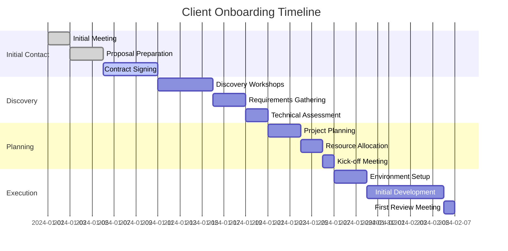
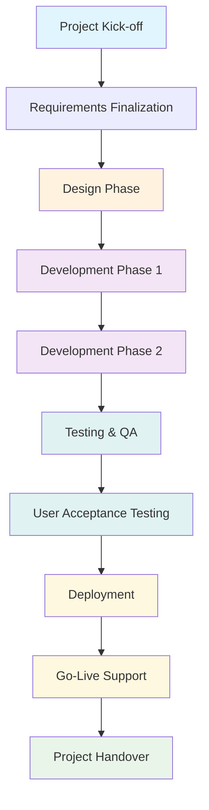

# 🤝 Client Onboarding Process

**Comprehensive New Client Integration Framework**

**Document Version:** 1.0
**Effective Date:** 1 Januari 2024
**Review Cycle:** Quarterly

---

## 📋 Overview

### **Purpose of Client Onboarding:**

- Establish clear expectations and project scope
- Build strong client relationship foundation
- Ensure smooth project kick-off and execution
- Minimize misunderstandings and scope creep
- Set up effective communication channels

### **Key Objectives:**

- ✅ Understand client's business needs and goals
- ✅ Define project scope, timeline, and deliverables
- ✅ Establish technical requirements and constraints
- ✅ Set up communication protocols and reporting
- ✅ Ensure all legal and administrative requirements are met

---

## 🎯 Onboarding Timeline

### **Phase-Based Timeline**



### **Phase Duration Guidelines:**

| Phase | Duration | Key Activities | Critical Success Factors |
|-------|----------|----------------|---------------------------|
| **Initial Contact** | 1-2 weeks | Discovery, proposal, contract | Clear value proposition, competitive pricing |
| **Discovery & Planning** | 2-3 weeks | Requirements, technical assessment | Thorough needs analysis, stakeholder alignment |
| **Project Kick-off** | 1 week | Team introduction, environment setup | Smooth technical setup, clear communication |
| **Initial Development** | 2-4 weeks | First deliverable, early feedback | Quick wins, iterative feedback |

---

## 🏢 Phase 1: Initial Contact & Engagement

### **Step 1: Initial Inquiry Response (Within 24 hours)**

#### **Response Checklist:**

- [ ] **Acknowledge receipt** of inquiry
- [ ] **Schedule discovery call** within 3 business days
- [ ] **Send company overview** and portfolio
- [ ] **Prepare preliminary questions** for the client
- [ ] **Assign primary contact** from Akordium team

#### **Initial Email Template:**

```
Subject: Re: [Client Company] - Web/App Development Inquiry

Dear [Client Name],

Thank you for your interest in PT Akordium Lab Digital!

I've received your inquiry about [project type] and would love to learn more about your requirements.

I'd like to schedule a 30-minute discovery call to discuss:
- Your project goals and objectives
- Timeline and budget considerations
- Technical requirements and preferences
- Team composition and collaboration preferences

Are you available on [Date 1], [Date 2], or [Date 3] for a call?

In the meantime, here are some resources about our work:
- Portfolio: [link]
- Case studies: [link]
- Client testimonials: [link]

Looking forward to speaking with you!

Best regards,
[Name]
[Title]
PT Akordium Lab Digital
```

### **Step 2: Discovery Call Preparation**

#### **Pre-Meeting Checklist:**

- [ ] **Research client company** thoroughly
- [ ] **Review industry trends** and competitors
- [ ] **Prepare tailored questions** based on inquiry
- [ ] **Set up meeting tools** (Zoom, screen sharing)
- [ ] **Invite relevant team members** (technical lead if needed)

#### **Discovery Call Agenda:**

| Time | Topic | Owner |
|-------|-------|-------|
| **0-5 min** | Introductions and background | PM |
| **5-15 min** | Client's business context | Client |
| **15-25 min** | Project requirements discussion | Both |
| **25-35 min** | Technical considerations | Tech Lead |
| **35-45 min** | Timeline and budget expectations | Both |
| **45-55 min** | Next steps and process explanation | PM |
| **55-60 min** | Q&A and wrap-up | Both |

#### **Key Questions to Ask:**

**Business Context:**

- What problem are you trying to solve?
- Who are your target users?
- What does success look like for this project?
- What's your business model?

**Project Requirements:**

- What are the must-have features?
- What are nice-to-have features?
- Are there any existing systems we need to integrate with?
- What's your preferred technology stack?

**Timeline & Budget:**

- What's your ideal launch date?
- Do you have any critical deadlines?
- What's your budget range?
- Are there any budget constraints we should know about?

**Team & Process:**

- Who will be our primary point of contact?
- Who makes final decisions?
- How do you prefer to communicate?
- What's your availability for meetings and feedback?

### **Step 3: Proposal Development**

#### **Proposal Structure:**

1. **Executive Summary**
   - Project overview
   - Key benefits
   - Investment summary

2. **Understanding of Requirements**
   - Business objectives
   - Technical requirements
   - User needs

3. **Proposed Solution**
   - Architecture overview
   - Feature list
   - Technology stack

4. **Project Plan**
   - Timeline and milestones
   - Team composition
   - Deliverables

5. **Investment Details**
   - Cost breakdown
   - Payment schedule
   - Terms and conditions

6. **Company Information**
   - About Akordium
   - Relevant experience
   - Team profiles

#### **Proposal Checklist:**

- [ ] **Executive summary** concisely captures project essence
- [ ] **Scope clearly defined** with specific deliverables
- [ ] **Timeline realistic** with buffer time
- [ ] **Cost breakdown transparent** with assumptions
- [ ] **Team composition appropriate** for project needs
- [ ] **Previous experience relevant** highlighted
- [ ] **Terms and conditions** clear and fair
- [ ] **Contact information** current and complete

---

## 🔍 Phase 2: Discovery & Requirements Analysis

### **Step 4: Stakeholder Identification**

#### **Stakeholder Mapping:**

| Stakeholder Type | Role | Influence | Interest | Communication Strategy |
|------------------|------|-----------|----------|----------------------|
| **Decision Maker** | [CEO/CTO/VP] | High | High | Weekly updates, key decisions |
| **Business Owner** | [Product Manager/Business Lead] | Medium | High | Bi-weekly meetings, requirements |
| **Technical Stakeholder** | [IT Manager/System Admin] | Medium | Medium | Technical coordination, integration |
| **End Users** | [Target audience] | Low | High | User testing, feedback sessions |
| **Finance** | [Finance Manager] | Low | Medium | Budget discussions, invoicing |

#### **Stakeholder Interview Questions:**

**For Decision Makers:**

- What are the business goals driving this project?
- How will you measure project success?
- What are the biggest risks you foresee?
- What's your decision-making process?

**For Business Owners:**

- What are your daily pain points this project should solve?
- How do you currently handle these processes?
- What does the ideal user experience look like?
- How will this integrate with existing workflows?

**For Technical Stakeholders:**

- What are your technical constraints?
- What systems need to be integrated?
- What are your security requirements?
- What are your deployment preferences?

**For End Users:**

- What would make your daily work easier?
- What do you like/dislike about current solutions?
- What features would be most valuable?
- How do you prefer to interact with software?

### **Step 5: Requirements Gathering Workshops**

#### **Workshop Preparation Checklist:**

- [ ] **Schedule workshop** with key stakeholders
- [ ] **Prepare workshop materials** (agenda, exercises)
- [ ] **Set up collaboration tools** (Miro, sticky notes)
- [ ] **Arrange recording/notes** (with permission)
- [ ] **Confirm attendance** and logistics

#### **Workshop Agenda (3-4 hours):**

| Time | Activity | Purpose |
|-------|----------|---------|
| **0-30 min** | Welcome & agenda review | Set expectations |
| **30-60 min** | Business context deep dive | Understand goals |
| **60-90 min** | User journey mapping | Identify touchpoints |
| **90-120 min** | Feature brainstorming | Generate ideas |
| **120-150 min** | Prioritization exercise | Rank importance |
| **150-180 min** | Risk identification | Anticipate challenges |
| **180-240 min** | Next steps & commitments | Action planning |

#### **Requirements Documentation Template:**

```markdown
## Project Requirements

### Business Requirements
- **BR-001:** [Business requirement description]
  - **Priority:** [High/Medium/Low]
  - **Source:** [Stakeholder who requested]
  - **Acceptance Criteria:** [How success is measured]

### Functional Requirements
- **FR-001:** [Functional requirement description]
  - **User Story:** As a [user], I want [action], so that [benefit]
  - **Priority:** [Must/Should/Could/Won't]
  - **Dependencies:** [Other requirements]

### Non-Functional Requirements
- **NFR-001:** [Non-functional requirement]
  - **Category:** [Performance/Security/Usability/etc.]
  - **Metric:** [Specific measurement]
  - **Target:** [Acceptable threshold]

### Technical Requirements
- **TR-001:** [Technical requirement]
  - **Technology:** [Specific technology or standard]
  - **Rationale:** [Why this requirement exists]
  - **Alternatives:** [Other options considered]
```

### **Step 6: Technical Assessment**

#### **Technical Analysis Checklist:**

**Current State Analysis:**

- [ ] **Existing systems inventory** documented
- [ ] **Integration points identified** and mapped
- [ ] **Technical constraints assessed** (legacy systems, regulations)
- [ ] **Security requirements evaluated** (compliance, data protection)
- [ ] **Performance requirements quantified** (users, transactions, response time)

**Solution Architecture:**

- [ ] **Technology stack selected** based on requirements
- [ ] **Scalability considerations** addressed
- [ ] **Integration architecture designed** (APIs, middleware)
- [ ] **Data architecture planned** (database design, data flow)
- [ ] **Deployment strategy defined** (cloud, on-premise, CI/CD)

**Infrastructure Planning:**

- [ ] **Hosting requirements assessed** (servers, storage, bandwidth)
- [ ] **Third-party services identified** (payment, email, analytics)
- [ ] **Monitoring and logging planned** (performance, errors, usage)
- [ ] **Backup and recovery strategy designed**
- [ ] **Disaster recovery plan outlined**

---

## 📋 Phase 3: Project Planning & Agreement

### **Step 7: Project Planning**

#### **Timeline Development:**



#### **Milestone Planning Template:**

| Milestone | Description | Target Date | Dependencies | Success Criteria |
|-----------|-------------|-------------|--------------|------------------|
| **Kick-off** | Project正式启动 | [Date] | Contract signed | Team aligned, tools ready |
| **Design Complete** | UI/UX and architecture approved | [Date] | Requirements approved | Client signs off on designs |
| **MVP Ready** | Core features working | [Date] | Design complete | Key features demonstrated |
| **Beta Release** | System testing with users | [Date] | MVP ready | User feedback collected |
| **Go-Live** | Production deployment | [Date] | Beta feedback addressed | System live and stable |
| **Project Complete** | Final deliverables and handover | [Date] | Go-Live successful | Documentation complete |

#### **Resource Planning:**

| Role | Person | Allocation | Cost | Duration | Total Cost |
|------|--------|-------------|------|----------|------------|
| **Project Manager** | [Name] | 100% | [Rate] | [Weeks] | [Amount] |
| **Tech Lead** | [Name] | 100% | [Rate] | [Weeks] | [Amount] |
| **Senior Developer** | [Name] | 100% | [Rate] | [Weeks] | [Amount] |
| **Mid Developer** | [Name] | 100% | [Rate] | [Weeks] | [Amount] |
| **UI/UX Designer** | [Name] | 75% | [Rate] | [Weeks] | [Amount] |
| **QA Engineer** | [Name] | 75% | [Rate] | [Weeks] | [Amount] |

### **Step 8: Contract Finalization**

#### **Contract Review Checklist:**

**Scope & Deliverables:**

- [ ] **Project scope clearly defined** with boundaries
- [ ] **Deliverables listed** with specifications
- [ ] **Exclusions documented** to prevent scope creep
- [ ] **Acceptance criteria defined** for each deliverable

**Timeline & Milestones:**

- [ ] **Project timeline** with key milestones
- [ ] **Payment schedule** tied to milestones
- [ ] **Delay provisions** for both parties
- [ ] **Extension procedures** for scope changes

**Financial Terms:**

- [ ] **Payment schedule clearly outlined**
- [ ] **Late payment penalties** specified
- [ ] **Change request process** and pricing
- [ ] **Additional costs** identified and explained

**Legal & IP:**

- [ ] **Intellectual property rights** clearly defined
- [ ] **Confidentiality provisions** included
- [ ] **Liability limitations** specified
- [ ] **Termination clauses** included

**Support & Maintenance:**

- [ ] **Post-launch support period** defined
- [ ] **Maintenance services** outlined
- [ ] **Bug fix policies** specified
- [ ] **Enhancement process** for future work

---

## 🚀 Phase 4: Project Kick-off

### **Step 9: Kick-off Meeting Preparation**

#### **Pre-Kick-off Checklist:**

- [ ] **Project management tools** configured and tested
- [ ] **Communication channels** set up (Slack, email groups)
- [ ] **Development environment** prepared
- [ ] **Documentation repository** created
- [ ] **Team calendars** synchronized
- [ ] **Meeting logistics** confirmed (room, video conference)

#### **Kick-off Meeting Agenda:**

| Time | Activity | Owner |
|-------|----------|-------|
| **0-10 min** | Welcome and introductions | PM |
| **10-20 min** | Project vision and goals | Client |
| **20-30 min** | Team introductions and roles | Akordium Team |
| **30-45 min** | Project scope and deliverables | PM |
| **45-60 min** | Timeline and milestones | PM |
| **60-75 min** | Communication plan and protocols | PM |
| **75-90 min** | Tools and processes overview | Tech Lead |
| **90-105 min** | Q&A and discussion | All |
| **105-120 min** | Next steps and commitments | PM |

### **Step 10: Environment & Tools Setup**

#### **Development Environment:**

**Code Repository:**

- [ ] **Git repository** created and configured
- [ ] **Branching strategy** documented
- [ ] **Access permissions** set up
- [ ] **Code review process** configured

**Project Management:**

- [ ] **Project board created** (Jira/Trello/Asana)
- [ ] **User accounts** created for all team members
- [ ] **Workflow configuration** completed
- [ ] **Reporting dashboards** set up

**Communication:**

- [ ] **Slack/Teams workspace** created
- [ ] **Channels set up** for different aspects
- [ ] **Email distribution lists** created
- [ ] **Meeting schedule** added to calendars

**Development Tools:**

- [ ] **IDE and development tools** installed
- [ ] **Database environment** set up
- [ ] **API documentation tools** configured
- [ ] **Testing frameworks** installed

#### **Client Access:**

**Project Visibility:**

- [ ] **Client dashboard** access configured
- [ ] **Progress reporting** set up
- [ ] **Demo environment** prepared
- [ ] **Feedback mechanisms** implemented

**Communication Access:**

- [ ] **Client Slack/Teams access** granted
- [ ] **Email aliases** created
- [ ] **Meeting links** shared
- [ ] **Emergency contact** information provided

---

## 📊 Phase 5: First Deliverable & Early Feedback

### **Step 11: First Sprint/Iteration**

#### **First Deliverable Planning:**

**Quick Win Strategy:**

- [ ] **Identify low-risk, high-value features** for first deliverable
- [ ] **Plan for visible progress** within 2-3 weeks
- [ ] **Set up early feedback mechanisms**
- [ ] **Prepare demonstration materials**

**First Deliverable Checklist:**

- [ ] **Core functionality implemented**
- [ ] **Basic UI/UX completed**
- [ ] **Unit tests written and passing**
- [ ] **Integration with key systems working**
- [ ] **Documentation created**
- [ ] **Demo environment deployed**

### **Step 12: First Review Meeting**

#### **Review Meeting Agenda:**

| Time | Activity | Owner |
|-------|----------|-------|
| **0-10 min** | Welcome and agenda | PM |
| **10-30 min** | Progress update and demo | Development Team |
| **30-45 min** | Client feedback and discussion | Client |
| **45-60 min** | Issues and concerns review | All |
| **60-75 min** | Next sprint planning | PM |
| **75-90 min** | Action items and commitments | All |

#### **Feedback Collection Template:**

| Aspect | Client Feedback | Rating (1-5) | Action Items |
|--------|----------------|--------------|--------------|
| **Functionality** | [Comments on features] | [Score] | [What to improve] |
| **User Experience** | [Comments on UI/UX] | [Score] | [What to improve] |
| **Performance** | [Comments on speed/stability] | [Score] | [What to improve] |
| **Communication** | [Comments on process] | [Score] | [What to improve] |
| **Overall Satisfaction** | [General feedback] | [Score] | [What to improve] |

---

## 📞 Ongoing Client Management

### **Regular Communication Schedule**

#### **Weekly Status Updates:**

```
Day: Friday
Time: 2:00 PM - 2:30 PM
Attendees: Project Manager, Tech Lead, Client Stakeholder
Format: Video call with screen sharing
Agenda:
- Progress this week
- Plans for next week
- Blockers and risks
- Upcoming decisions needed
```

#### **Monthly Business Reviews:**

```
Day: First Friday of month
Time: 10:00 AM - 11:00 AM
Attendees: Full project team, client decision makers
Format: In-person or extended video call
Agenda:
- Business value delivered
- ROI analysis
- Strategic alignment
- Future planning
- Budget review
```

#### **Ad-hoc Communications:**

- **Urgent Issues:** Immediate contact via phone/Slack
- **Important Decisions:** Scheduled meeting with stakeholders
- **Clarifications:** Email or Slack with clear expectations
- **Demo Requests:** 24-hour notice for preparation

### **Client Satisfaction Monitoring**

#### **Satisfaction Metrics:**

| Metric | Measurement Method | Target | Frequency |
|--------|-------------------|--------|-----------|
| **Communication Effectiveness** | Survey rating | 4.5/5 | Monthly |
| **Feature Satisfaction** | Feedback scores | 4.0/5 | Per release |
| **Timeline Adherence** | On-time delivery percentage | 90% | Per milestone |
| **Budget Performance** | Cost variance percentage | ±10% | Monthly |
| **Overall Satisfaction** | Net Promoter Score | +40 | Quarterly |

#### **Issue Resolution Process:**

1. **Issue Identification:** Any stakeholder can raise issues
2. **Immediate Acknowledgment:** Response within 4 hours
3. **Impact Assessment:** Severity and scope evaluation
4. **Resolution Planning:** Action plan and timeline
5. **Implementation:** Execute resolution strategy
6. **Verification:** Client confirms issue resolved
7. **Documentation:** Update processes to prevent recurrence

---

## ✅ Onboarding Success Checklist

### **Pre-Onboarding Requirements:**

- [ ] **Sales handoff completed** with full context
- [ ] **Initial research completed** on client company
- [ ] **Proposal template reviewed** and customized
- [ ] **Team availability confirmed** for the project

### **Discovery Phase Completion:**

- [ ] **All key stakeholders identified** and interviewed
- [ ] **Requirements documented** and prioritized
- [ ] **Technical assessment completed** with recommendations
- [ ] **Risks identified** and mitigation strategies planned

### **Planning Phase Completion:**

- [ ] **Project plan developed** with realistic timeline
- [ ] **Resource allocation confirmed** and scheduled
- [ ] **Contract terms finalized** and signed
- [ ] **Change request process** established

### **Kick-off Phase Completion:**

- [ ] **Kick-off meeting conducted** successfully
- [ ] **Development environment** fully set up
- [ ] **Communication channels** established and tested
- [ ] **Project documentation** created and shared

### **Early Delivery Phase Completion:**

- [ ] **First deliverable completed** on time
- [ ] **Client feedback collected** and incorporated
- [ ] **Process adjustments made** based on feedback
- [ ] **Next phase planning** completed with client input

---

## 📋 Templates & Resources

### **Email Templates**

#### **Project Kick-off Announcement:**

```
Subject: Project Kick-off: [Project Name]

Dear [Client Name],

We're excited to officially kick off the [Project Name] project!

**Project Details:**
- **Start Date:** [Date]
- **Duration:** [Timeline]
- **Team:** [Team members and roles]
- **Key Milestones:** [Major milestones]

**Communication Channels:**
- **Daily Updates:** [Slack channel]
- **Weekly Meetings:** [Meeting link]
- **Project Dashboard:** [Dashboard link]
- **Emergency Contact:** [Phone number]

**Next Steps:**
1. Team introduction meeting: [Date/Time]
2. Detailed requirements workshop: [Date/Time]
3. First deliverable planning: [Date/Time]

We're looking forward to working with you on this exciting project!

Best regards,
[Name]
Project Manager
PT Akordium Lab Digital
```

#### **Status Update Template:**

```
Subject: Weekly Status Update - [Project Name] - [Date]

Hi [Client Name],

Here's our weekly status update for [Project Name]:

**Accomplished This Week:**
- ✅ [Task/Feature 1]
- ✅ [Task/Feature 2]
- ✅ [Task/Feature 3]

**Planned for Next Week:**
- 🔄 [Task/Feature 1]
- 🔄 [Task/Feature 2]
- 🔄 [Task/Feature 3]

**Current Metrics:**
- **Progress:** [Percentage]% complete
- **Timeline:** On track / At risk / Delayed
- **Budget:** On budget / Over budget / Under budget

**Issues and Risks:**
- 🚨 [Issue 1]: [Status and resolution plan]
- ⚠️ [Risk 1]: [Mitigation strategy]

**Decisions Needed:**
- 📋 [Decision 1]: [Context and deadline]
- 📋 [Decision 2]: [Context and deadline]

Please let me know if you have any questions or concerns.

Best regards,
[Name]
Project Manager
```

### **Meeting Templates**

#### **Requirements Workshop Agenda:**

```
**Requirements Workshop**
**Date:** [Date]
**Duration:** 3 hours
**Participants:** [List of attendees]

**Objectives:**
- Understand business goals and success criteria
- Identify all stakeholders and their needs
- Document functional and non-functional requirements
- Prioritize features based on business value

**Agenda:**
1. Welcome and introductions (15 min)
2. Business context and goals (30 min)
3. User journey mapping (45 min)
4. Feature brainstorming (45 min)
5. Prioritization exercise (30 min)
6. Risk identification (15 min)
7. Next steps and commitments (15 min)

**Preparation:**
- Review client's website and materials
- Prepare user persona templates
- Set up collaboration tools (Miro board)
- Schedule follow-up meetings if needed
```

---

**Document Version:** 1.0
**Last Updated:** 1 Januari 2024
**Next Review:** 1 April 2024
**Maintained by:** Project Management Office, PT Akordium Lab Digital

> 💡 **Client Success Tip:** The most successful client relationships are built on clear communication, realistic expectations, and delivering value early and often. Remember that onboarding isn't a one-time event - it's the foundation for an ongoing partnership.
