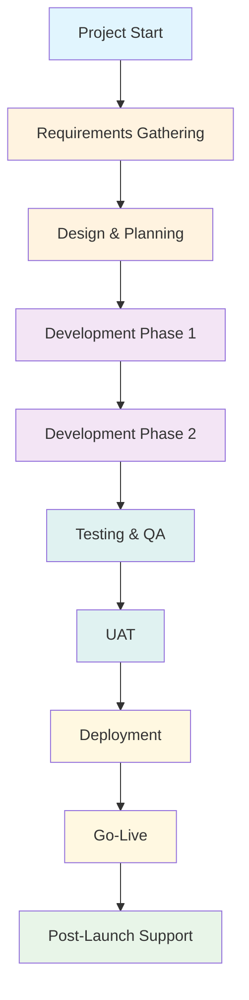

# 🚀 Project Initiation Template

**Comprehensive Project Kick-off Framework**

**Template Version:** 1.0
**Effective Date:** 1 Januari 2024
**Review Cycle:** Quarterly

---

## 📋 Project Overview

### **Basic Information**

| Field | Description |
|-------|-------------|
| **Project Name** | [Nama Project] |
| **Project Code** | [PROJ-XXX] |
| **Client Name** | [Nama Klien] |
| **Project Manager** | [PM Name] |
| **Tech Lead** | [Tech Lead Name] |
| **Start Date** | [DD/MM/YYYY] |
| **Target End Date** | [DD/MM/YYYY] |
| **Project Type** | [Web App / Mobile App / API / Dashboard / etc.] |

### **Project Summary**

> [Deskripsi singkat project dalam 2-3 kalimat - apa yang akan dibuat, untuk siapa, dan apa value utamanya]

---

## 🎯 Project Objectives

### **SMART Goals**

| Objective | Success Metrics | Target | Timeline |
|-----------|-----------------|--------|----------|
| [Goal 1] | [KPI 1] | [Target Value] | [Deadline] |
| [Goal 2] | [KPI 2] | [Target Value] | [Deadline] |
| [Goal 3] | [KPI 3] | [Target Value] | [Deadline] |

### **Business Value**

#### **Primary Benefits:**

- [ ] **Revenue Impact:** [Estimasi revenue impact per tahun]
- [ ] **Cost Savings:** [Estimasi cost savings per tahun]
- [ ] **Efficiency Gains:** [Time savings untuk user/staff]
- [ ] **Customer Experience:** [Improvement areas]

#### **Secondary Benefits:**

- [ ] **Brand Enhancement:** [Impact pada brand klien]
- [ ] **Market Position:** [Competitive advantage]
- [ ] **Innovation:** [Technical/business innovation]
- [ ] **Scalability:** [Future expansion possibilities]

---

## 📊 Scope Definition

### **In Scope**

| Feature Category | Description | Priority |
|------------------|-------------|----------|
| **Core Features** | [Daftar core features yang wajib] | High |
| **User Management** | [Authentication, authorization, roles] | High |
| **Data Management** | [CRUD operations, data validation] | High |
| **Reporting** | [Analytics, dashboards, exports] | Medium |
| **Integrations** | [Third-party API integrations] | Medium |
| **Mobile Features** | [Responsive design, PWA, native apps] | Low |

### **Out of Scope**

| Feature | Reason for Exclusion | Future Phase |
|---------|---------------------|--------------|
| [Feature 1] | [Alasan exclusion] | [Phase jika akan dikembangkan] |
| [Feature 2] | [Alasan exclusion] | [Phase jika akan dikembangkan] |
| [Feature 3] | [Alasan exclusion] | [Phase jika akan dikembangkan] |

### **Project Boundaries**



---

## 👥 Stakeholders

### **Primary Stakeholders**

| Role | Name/Department | Contact | Responsibilities | Influence |
|------|----------------|---------|-------------------|------------|
| **Project Sponsor** | [Nama Sponsor] | [Email/Phone] | Budget approval, strategic decisions | High |
| **Business Owner** | [Nama Business Owner] | [Email/Phone] | Business requirements, acceptance | High |
| **End Users** | [User Group] | [Contact Info] | User requirements, feedback | Medium |
| **IT Department** | [IT Contact] | [Email/Phone] | Infrastructure support | Medium |

### **Project Team**

| Role | Name | Allocation | Contact | Backup |
|------|------|-------------|---------|--------|
| **Project Manager** | [PM Name] | 100% | [Email] | [Backup PM] |
| **Tech Lead** | [Tech Lead] | 100% | [Email] | [Backup Lead] |
| **Backend Developer** | [Dev Name] | [Hours/week] | [Email] | [Backup Dev] |
| **Frontend Developer** | [Dev Name] | [Hours/week] | [Email] | [Backup Dev] |
| **UI/UX Designer** | [Designer] | [Hours/week] | [Email] | [Backup Designer] |
| **QA Engineer** | [QA Name] | [Hours/week] | [Email] | [Backup QA] |

### **Communication Matrix**

| Frequency | Meeting Type | Participants | Purpose | Platform |
|-----------|--------------|--------------|---------|----------|
| **Daily** | Stand-up | Dev Team | Progress update, blockers | Office |
| **Weekly** | Sprint Review | All Team | Demo, feedback | Meeting Room |
| **Bi-weekly** | Client Update | PM + Client | Status, decisions | Video Call |
| **Monthly** | Steering Committee | Stakeholders | Strategic review | Meeting Room |

---

## 💰 Project Budget

### **Cost Breakdown**

| Category | Estimated Cost | Actual Cost | Variance | Notes |
|----------|----------------|-------------|----------|-------|
| **Personnel Costs** | Rp [Amount] | Rp [Amount] | Rp [Amount] | [Breakdown per role] |
| **Infrastructure** | Rp [Amount] | Rp [Amount] | Rp [Amount] | Server, hosting, licenses |
| **Tools & Software** | Rp [Amount] | Rp [Amount] | Rp [Amount] | IDE licenses, design tools |
| **Training** | Rp [Amount] | Rp [Amount] | Rp [Amount] | Certifications, workshops |
| **Contingency (10%)** | Rp [Amount] | Rp [Amount] | Rp [Amount] | Risk buffer |
| **Total** | **Rp [Total]** | **Rp [Actual]** | **Rp [Variance]** | |

### **Budget Tracking Template**

```text
Date | Category | Description | Budgeted | Actual | Variance | Notes
-----|----------|-------------|----------|---------|----------|------
[Date] | Personnel | Backend Developer (2 months) | Rp 20M | Rp 0 | Rp 20M | Pending
[Date] | Infrastructure | Cloud hosting (6 months) | Rp 5M | Rp 0 | Rp 5M | Pending
...
```

---

## ⏰ Project Timeline

### **Major Milestones**

| Milestone | Target Date | Actual Date | Status | Dependencies |
|-----------|-------------|-------------|---------|--------------|
| **Project Kick-off** | [DD/MM/YYYY] | [DD/MM/YYYY] | ✅/⏳/❌ | Contract signed |
| **Requirements Complete** | [DD/MM/YYYY] | [DD/MM/YYYY] | ✅/⏳/❌ | Client approval |
| **Design Phase Complete** | [DD/MM/YYYY] | [DD/MM/YYYY] | ✅/⏳/❌ | Requirements approved |
| **MVP Development** | [DD/MM/YYYY] | [DD/MM/YYYY] | ✅/⏳/❌ | Design complete |
| **UAT Start** | [DD/MM/YYYY] | [DD/MM/YYYY] | ✅/⏳/❌ | MVP deployed |
| **Go-Live** | [DD/MM/YYYY] | [DD/MM/YYYY] | ✅/⏳/❌ | UAT approved |
| **Project Closure** | [DD/MM/YYYY] | [DD/MM/YYYY] | ✅/⏳/❌ | Go-live successful |

### **Phase Breakdown**

#### **Phase 1: Discovery & Planning (Week 1-2)**

- [ ] Requirements gathering workshops
- [ ] Technical architecture design
- [ ] UI/UX wireframes
- [ ] Project setup and tooling

#### **Phase 2: Design & Prototyping (Week 3-4)**

- [ ] Detailed UI/UX design
- [ ] Database design
- [ ] API specification
- [ ] Prototype development

#### **Phase 3: Core Development (Week 5-10)**

- [ ] Backend development
- [ ] Frontend development
- [ ] Integration development
- [ ] Unit testing

#### **Phase 4: Testing & Refinement (Week 11-12)**

- [ ] Integration testing
- [ ] Performance testing
- [ ] Security testing
- [ ] Bug fixes

#### **Phase 5: Deployment & Launch (Week 13-14)**

- [ ] User Acceptance Testing (UAT)
- [ ] Production deployment
- [ ] User training
- [ ] Go-live support

---

## 🔧 Technical Requirements

### **Technology Stack**

| Component | Technology | Version | Rationale |
|-----------|------------|---------|-----------|
| **Backend** | [Go/Laravel/Node.js] | [Version] | [Alasan pemilihan] |
| **Frontend** | [React/Vue/Angular] | [Version] | [Alasan pemilihan] |
| **Database** | [PostgreSQL/MySQL] | [Version] | [Alasan pemilihan] |
| **Infrastructure** | [AWS/OCI/DigitalOcean] | [N/A] | [Alasan pemilihan] |
| **Deployment** | [Docker/Kubernetes] | [Version] | [Alasan pemilihan] |

### **Non-Functional Requirements**

| Requirement | Specification | Priority |
|-------------|----------------|----------|
| **Performance** | Response time < 2 seconds | High |
| **Scalability** | Support 1000 concurrent users | Medium |
| **Availability** | 99.5% uptime | High |
| **Security** | OWASP compliance | High |
| **Maintainability** | 80% code coverage | Medium |
| **Accessibility** | WCAG 2.1 AA compliance | Medium |

### **Integration Requirements**

| System | Integration Type | Method | Frequency |
|--------|-----------------|--------|-----------|
| [External API] | [REST/GraphQL] | [Webhook/API Call] | [Real-time/Batch] |
| [Payment Gateway] | [REST API] | [API Integration] | [Transaction-based] |
| [Email Service] | [SMTP/API] | [Email Gateway] | [Event-triggered] |

---

## ⚠️ Risk Assessment

### **Risk Register**

| Risk | Probability | Impact | Risk Score | Mitigation Strategy | Owner |
|------|-------------|---------|------------|--------------------|-------|
| **Scope Creep** | High | High | 9 | Strict change control process | PM |
| **Technical Complexity** | Medium | High | 6 | Proof of concept, spike stories | Tech Lead |
| **Resource Shortage** | Low | High | 3 | Resource backup plan | PM |
| **Client Delays** | Medium | Medium | 4 | Regular check-ins, clear timelines | PM |
| **Integration Issues** | Medium | Medium | 4 | Early integration testing | Tech Lead |
| **Security Breach** | Low | High | 3 | Security audit, penetration testing | Tech Lead |

### **Risk Mitigation Plan**

#### **High-Priority Risks:**

1. **Scope Creep:**
   - **Prevention:** Clear scope definition, change request process
   - **Monitoring:** Weekly scope review meetings
   - **Response:** Change impact analysis, stakeholder approval

2. **Technical Complexity:**
   - **Prevention:** Technical spikes, proof of concepts
   - **Monitoring:** Code reviews, architectural reviews
   - **Response:** Technical debt management, expert consultation

3. **Timeline Delays:**
   - **Prevention:** Buffer time in estimates, critical path analysis
   - **Monitoring:** Daily progress tracking, burndown charts
   - **Response:** Resource reallocation, scope reduction

---

## 📋 Project Governance

### **Decision-Making Process**

#### **Decision Levels:**

1. **Strategic Decisions:** [Budget > Rp 50M, Scope changes > 20%]
2. **Tactical Decisions:** [Technology choices, timeline adjustments]
3. **Operational Decisions:** [Daily priorities, resource allocation]

#### **Approval Matrix:**

| Decision Type | Required Approvals | Notification |
|---------------|-------------------|--------------|
| **Budget Changes** | Project Sponsor + Finance | All Stakeholders |
| **Scope Changes** | Client + Project Sponsor | Project Team |
| **Timeline Changes** | Project Manager + Tech Lead | All Stakeholders |
| **Technical Decisions** | Tech Lead + Project Manager | Development Team |

### **Quality Management**

#### **Quality Gates:**

1. **Requirements Review:** Client approval required
2. **Design Review:** Technical + Business approval
3. **Code Review:** Peer review + automated testing
4. **Testing Review:** QA sign-off required
5. **UAT Sign-off:** Client acceptance required

#### **Quality Metrics:**

- **Defect Density:** < 1 defect per 1000 lines of code
- **Code Coverage:** > 80%
- **Performance:** Response time < 2 seconds
- **User Satisfaction:** > 4/5 rating

---

## 📊 Success Metrics & KPIs

### **Project Success Criteria**

| Success Dimension | KPI | Target | Measurement Frequency |
|-------------------|-----|--------|----------------------|
| **Schedule** | On-time delivery | 100% | Milestone basis |
| **Budget** | Budget adherence | ±10% variance | Monthly |
| **Quality** | Defect rate | < 5 critical bugs | Release basis |
| **Scope** | Requirements coverage | 100% | Project completion |
| **Stakeholder Satisfaction** | Satisfaction score | > 4/5 | Post-project |

### **Business Impact Metrics**

| Metric | Baseline | Target | Measurement Method |
|--------|----------|--------|--------------------|
| **User Adoption** | [Current users] | [Target users] | Analytics tracking |
| **Process Efficiency** | [Current time] | [Target time] | Time studies |
| **Cost Reduction** | [Current cost] | [Target reduction] | Financial analysis |
| **Revenue Increase** | [Current revenue] | [Target increase] | Sales reporting |

---

## 📝 Documentation & Deliverables

### **Required Deliverables**

| Deliverable | Description | Due Date | Owner | Format |
|-------------|-------------|----------|-------|--------|
| **Project Charter** | Project overview and objectives | Week 1 | PM | PDF |
| **Requirements Document** | Functional and non-functional requirements | Week 2 | BA | Word/Confluence |
| **Technical Architecture** | System design and infrastructure | Week 3 | Tech Lead | Diagrams |
| **Project Plan** | Detailed timeline and resources | Week 1 | PM | MS Project |
| **Test Plan** | Testing strategy and test cases | Week 6 | QA | Excel/Confluence |
| **User Manual** | End-user documentation | Week 12 | BA | PDF |
| **Deployment Guide** | Technical deployment instructions | Week 12 | Tech Lead | Markdown |

### **Communication Plan**

| Communication | Frequency | Audience | Method | Owner |
|---------------|-----------|----------|--------|-------|
| **Status Report** | Weekly | All Stakeholders | Email + Dashboard | PM |
| **Sprint Review** | Bi-weekly | Project Team | Meeting | Tech Lead |
| **Client Update** | Bi-weekly | Client | Video Call | PM |
| **Steering Committee** | Monthly | Executive Team | Presentation | PM |
| **Risk Review** | Monthly | Project Team | Meeting | PM |

---

## ✅ Project Initiation Checklist

### **Pre-Kick-off Preparation:**

- [ ] **Project charter signed and approved**
- [ ] **Budget approved and allocated**
- [ ] **Key stakeholders identified and engaged**
- [ ] **Project team assembled and assigned**
- [ ] **Communication channels established**
- [ ] **Project management tools configured**
- [ ] **Development environment set up**
- [ ] **Initial requirements gathered**

### **Kick-off Meeting Preparation:**

- [ ] **Agenda prepared and distributed**
- [ ] **Presentation slides ready**
- [ ] **Stakeholder invitations sent**
- [ ] **Meeting room/platform booked**
- [ ] **Documentation templates prepared**
- [ ] **Risk assessment completed**
- [ ] **Success metrics defined**
- [ ] **Communication plan finalized**

### **Post-Kick-off Actions:**

- [ ] **Meeting minutes distributed**
- [ ] **Action items assigned and tracked**
- [ ] **Project repository created**
- [ ] **Team collaboration tools configured**
- [ ] **First sprint/backlog planning scheduled**
- [ ] **Regular meeting cadence established**
- [ ] **Change control process documented**
- [ ] **Quality assurance procedures defined**

---

## 📞 Contact Information

### **Emergency Contacts:**

| Role | Person | Contact | Availability |
|------|--------|---------|--------------|
| **Project Sponsor** | [Name] | [Phone] | [Business hours] |
| **Project Manager** | [Name] | [Phone] | [Business hours] |
| **Tech Lead** | [Name] | [Phone] | [Business hours] |
| **IT Support** | [Name] | [Phone] | [24/7 for emergencies] |

### **Regular Support Channels:**

- **Project Communication:** [Slack/Teams channel]
- **Issue Tracking:** [Jira/Asana board]
- **Documentation:** [Confluence/Notion space]
- **Code Repository:** [GitHub/GitLab repository]
- **Status Dashboard:** [Power BI/Looker Studio URL]

---

**Document Version:** 1.0
**Last Updated:** 1 Januari 2024
**Next Review:** 1 April 2024
**Maintained by:** Project Management Office, PT Akordium Lab Digital

> 💡 **Success Tip:** The most critical success factor for any project is clear alignment between all stakeholders on scope, timeline, and expectations. Regular communication and proactive risk management are essential for project success.
