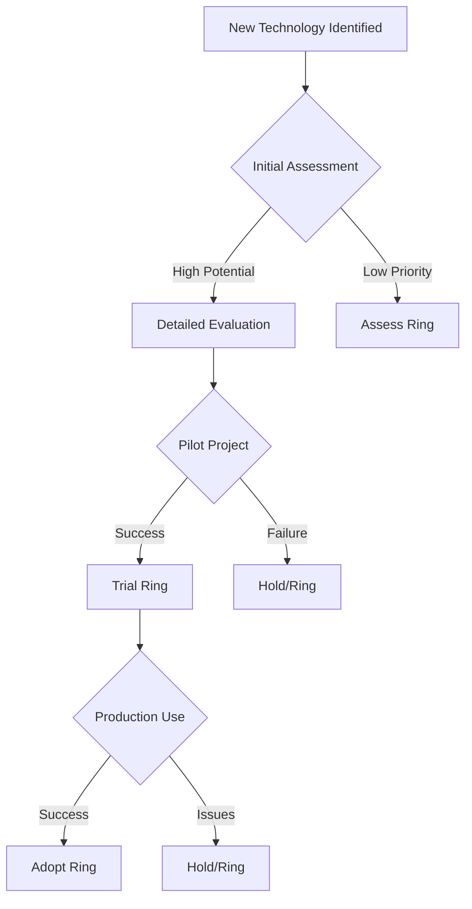

# 📡 Technology Radar

**Technology Assessment & Adoption Framework**

**Document Version:** 1.0
**Effective Date:** 1 Januari 2024
**Review Cycle:** Quarterly
**Maintained by:** CTO & Tech Lead

---

## 🎯 Technology Radar Overview

### **Purpose:**

- Provide structured approach to technology evaluation
- Guide technology adoption decisions across projects
- Track emerging trends and industry standards
- Reduce technical debt through informed choices
- Enable knowledge sharing across teams

### **Radar Philosophy:**

- **Business Value First:** Technologies must solve real business problems
- **Pragmatic Adoption:** Balance innovation with stability
- **Team Capability:** Consider team expertise and learning curve
- **Long-term Viability:** Assess sustainability and community support

---

## 📊 Radar Quadrants

### **Quadrant Definitions:**

| Quadrant | Description | Examples |
|----------|-------------|----------|
| **🔷 Languages & Frameworks** | Programming languages, frameworks, libraries | Go, Laravel, Next.js, React |
| **🔧 Platforms & Infrastructure** | Cloud platforms, databases, messaging systems | PostgreSQL, Redis, Kubernetes |
| **🛠️ Tools & Practices** | Development tools, methodologies, testing | Docker, CI/CD, Testing frameworks |
| **📈 Techniques & Patterns** | Architectural patterns, design approaches | Microservices, Serverless, TDD |

### **Ring Classifications:**

| Ring | Definition | Action | Timeline |
|------|------------|--------|----------|
| **🟢 Adopt** | Proven, low-risk technologies | Use without reservation | Immediate |
| **🟡 Trial** | Promising but needs evaluation | Pilot in small projects | 1-3 months |
| **🔵 Assess** | Emerging potential, requires research | Evaluate for future use | 3-6 months |
| **🔴 Hold** | Use with caution or avoid | Only if required | Existing projects only |

---

## 🔷 Languages & Frameworks

### **Adopt (Green Ring)**

| Technology | Version | Use Cases | Justification |
|------------|---------|-----------|---------------|
| **Go** | 1.21+ | Backend APIs, Microservices, CLI tools | High performance, great concurrency, strong typing |
| **Laravel** | 10+ | Web applications, APIs, Admin panels | Mature ecosystem, rapid development, good documentation |
| **Next.js** | 13+ | React applications, SSR, static sites | Excellent DX, great performance, SEO friendly |
| **PostgreSQL** | 15+ | Primary database, analytics, geospatial | Robust, feature-rich, excellent extension ecosystem |
| **React** | 18+ | Frontend applications, UI components | Large ecosystem, component-based, great community |

### **Trial (Yellow Ring)**

| Technology | Version | Pilot Projects | Evaluation Criteria |
|------------|---------|----------------|-------------------|
| **TypeScript** | 5.0+ | Frontend projects with complex state management | Type safety, developer experience, migration complexity |
| **Vue.js** | 3.0+ | Small frontend prototypes | Learning curve, ecosystem maturity, performance |
| **FastAPI** | 0.100+ | Internal tools, simple APIs | Development speed, async performance, documentation |
| **Prisma** | 5.0+ | New projects with complex schemas | Type safety, migration tools, performance |
| **SvelteKit** | 1.0+ | Marketing sites, small applications | Bundle size, performance, developer experience |

### **Assess (Blue Ring)**

| Technology | Research Focus | Potential Applications | Research Questions |
|------------|----------------|----------------------|-------------------|
| **Rust** | System programming, CLI tools | Performance-critical components | Learning curve, ecosystem maturity, use cases |
| **Deno** | Backend APIs, CLI tools | JavaScript runtime alternatives | Security, ecosystem, migration path |
| **SolidJS** | React applications | Lightweight frontend framework | Performance, learning curve, migration |
| **Tauri** | Desktop applications | Cross-platform desktop apps | Performance, security, distribution |
| **WebAssembly** | Performance-critical web features | Compute-intensive applications | Browser support, tooling, integration complexity |

### **Hold (Red Ring)**

| Technology | Reason for Hold | Exceptions | Migration Path |
|------------|----------------|-----------|---------------|
| **AngularJS** | End of life, security issues | Legacy maintenance only | Migrate to Angular 2+ or React |
| **jQuery** | Outdated patterns, better alternatives | Legacy code maintenance | Replace with vanilla JS or modern framework |
| **PHP < 8.0** | Security issues, missing features | Legacy applications | Upgrade to PHP 8.0+ or migrate to modern framework |
| **MySQL < 8.0** | Missing features, performance issues | Legacy systems | Upgrade to MySQL 8.0+ or migrate to PostgreSQL |
| **Webpack 4** | Outdated, better alternatives available | Legacy builds | Upgrade to Webpack 5+ or migrate to Vite |

---

## 🔧 Platforms & Infrastructure

### **Adopt (Green Ring)**

| Technology | Use Cases | Best Practices | Monitoring |
|------------|-----------|----------------|------------|
| **Docker** | Containerization, development environments | Multi-stage builds, slim images, security scanning | Resource usage, image size, build time |
| **PostgreSQL** | Primary database, analytics, geospatial | Connection pooling, proper indexing, backup strategies | Query performance, connection metrics, replication lag |
| **Redis** | Caching, session storage, message queue | Proper memory management, persistence, clustering | Memory usage, hit rates, connection metrics |
| **GitHub Actions** | CI/CD, automation workflows | Reusable workflows, proper secrets management, caching | Build time, success rate, resource usage |
| **Linux (Ubuntu LTS)** | Server infrastructure, development environment | Security updates, proper user management, monitoring | System metrics, security alerts, uptime |

### **Trial (Yellow Ring)**

| Technology | Pilot Focus | Success Metrics | Concerns |
|------------|-------------|----------------|----------|
| **Kubernetes** | Microservices deployment | Scalability, resilience, deployment speed | Complexity, learning curve, resource requirements |
| **AWS Lambda** | Serverless functions, APIs | Cost efficiency, scalability, cold start performance | Vendor lock-in, debugging complexity |
| **Elasticsearch** | Full-text search, logging | Search performance, relevance, scalability | Resource usage, operational complexity |
| **MinIO** | Object storage, S3-compatible storage | Performance, compatibility, cost | Feature parity, stability, documentation |
| **Prometheus** | Monitoring, alerting | Metric collection, alerting accuracy, dashboard usability | Resource usage, configuration complexity |

### **Assess (Blue Ring)**

| Technology | Research Questions | Evaluation Areas | Potential Benefits |
|------------|-------------------|-----------------|-------------------|
| **Cloudflare Workers** | Edge computing capabilities, performance | Cold start times, vendor lock-in, integration complexity | Global edge network, performance, cost |
| **Supabase** | PostgreSQL-based Firebase alternative | Features, pricing, migration path | Open-source, real-time capabilities |
| **Temporal.io** | Workflow orchestration | Learning curve, integration complexity | Reliable distributed workflows |
| **Neo4j** | Graph database use cases | Query performance, use case fit | Relationship data modeling |
| **Traefik** | Advanced load balancing | Configuration complexity, feature set | Dynamic configuration, observability |

### **Hold (Red Ring)**

| Technology | Reason | Alternatives | Migration Strategy |
|------------|--------|-------------|-------------------|
| **MongoDB < 4.0** | Performance issues, licensing | PostgreSQL, MySQL | Database migration with data transformation |
| **Heroku** | Cost, vendor lock-in | DigitalOcean, AWS, self-hosted | Container-based migration to cloud providers |
| **Jenkins** | Complexity, maintenance overhead | GitHub Actions, GitLab CI | Pipeline migration to modern CI/CD |
| **Monolithic architecture** | Scalability, deployment complexity | Microservices, modular monolith | Gradual refactoring to service-based architecture |

---

## 🛠️ Tools & Practices

### **Adopt (Green Ring)**

| Tool/Practice | Application Area | Implementation | Success Metrics |
|----------------|------------------|----------------|-----------------|
| **Git** | Version control | Feature branches, PR workflow, code reviews | Branching strategy effectiveness, merge conflicts |
| **Testing (Unit/Integration)** | Quality assurance | TDD, test-driven development, coverage reporting | Bug reduction, confidence in refactoring |
| **Code Review** | Code quality | Peer reviews, automated analysis tools | Code quality metrics, knowledge sharing |
| **API Documentation (OpenAPI)** | Integration, communication | Swagger/OpenAPI specification, interactive docs | API adoption, integration speed |
| **Security Scanning** | Security | OWASP scanning, dependency checking, SAST | Vulnerability count, security incident prevention |

### **Trial (Yellow Ring)**

| Tool/Practice | Pilot Projects | Evaluation Criteria | Success Indicators |
|----------------|---------------|-------------------|------------------|
| **GraphQL** | API development, frontend data fetching | Developer experience, performance, client adoption | Query efficiency, type safety |
| **E2E Testing (Playwright)** | Critical user flows | Test reliability, maintenance effort, test coverage | Bug detection, confidence in deployments |
| **Infrastructure as Code (Terraform)** | Infrastructure management | Reproducibility, disaster recovery, cost optimization | Deployment time, configuration accuracy |
| **Microservices** | New service development | Service boundaries, communication patterns, monitoring | Service autonomy, deployment independence |
| **Chaos Engineering** | System resilience | Failure identification, recovery procedures, team readiness | System reliability, incident response time |

### **Assess (Blue Ring)**

| Tool/Practice | Research Focus | Key Questions | Potential Applications |
|----------------|---------------|--------------|---------------------|
| **Serverless Architecture** | Cost optimization, scalability | Cold start mitigation, vendor lock-in, debugging | Event-driven applications, APIs |
| **Event Sourcing** | Data architecture | Event schema evolution, snapshot strategies, performance | Audit trails, event replay, complex business logic |
| **CQRS** | Application architecture | Read/write model synchronization, complexity | High-performance systems, complex domain models |
| **Domain-Driven Design** | Software design | Bounded context identification, strategic design, team organization | Complex business domains, large applications |
| **Observability (Distributed Tracing)** | System monitoring | Implementation complexity, data volume, integration strategy | Microservices, distributed systems |

---

## 📈 Techniques & Patterns

### **Adopt (Green Ring)**

| Pattern | Application Area | Implementation Guidelines | Benefits |
|---------|------------------|-------------------------|----------|
| **Repository Pattern** | Data access | Interface-based, testable, focused on single entity | Testability, separation of concerns |
| **Dependency Injection** | Application architecture | Constructor injection, interface-based, IoC containers | Testability, loose coupling |
| **Clean Architecture** | Application design | Layer separation, dependency rule, use cases | Maintainability, testability |
| **API Versioning** | Public APIs | URL versioning, backward compatibility, deprecation policy | Evolution without breaking changes |
| **Database Migrations** | Database management | Version-controlled, reversible, tested deployments | Consistent database state, team collaboration |

### **Trial (Yellow Ring)**

| Pattern | Pilot Projects | Evaluation Criteria | Success Metrics |
|---------|---------------|-------------------|-----------------|
| **CQRS** | Complex business logic | Performance impact, complexity reduction, team understanding | Query performance, development velocity |
| **Event-Driven Architecture** | Integration-heavy applications | Scalability, resilience, team adoption | System decoupling, fault tolerance |
| **Circuit Breaker** | Resilience | Implementation complexity, effectiveness, monitoring | System reliability, failure isolation |
| **API Gateway Pattern** | Microservices | Centralized management, performance, security | API consistency, policy enforcement |
| **Saga Pattern** | Distributed transactions | Complexity reduction, consistency, error handling | Data consistency, system reliability |

### **Assess (Blue Ring)**

| Pattern | Research Areas | Evaluation Questions | Potential Use Cases |
|---------|----------------|-------------------|-------------------|
| **Hexagonal Architecture** | Application design | Testability, framework independence, team adoption | Framework migration, testing requirements |
| **Actor Model** | Concurrent systems | Performance, scalability, team learning curve | High-concurrency systems, real-time applications |
| **Feature Toggles** | Continuous deployment | Management complexity, testing requirements, technical debt | Feature rollout, A/B testing, canary releases |
| **Strangler Fig Pattern** | Legacy system migration | Migration complexity, risk management, team coordination | Gradual legacy modernization |
| **Anti-Corruption Layer** | System integration | Maintenance overhead, performance impact, team understanding | Integrating with legacy or external systems |

---

## 🔄 Evaluation Process

### **Quarterly Review Process**

#### **1. Technology Scouting**

- **Community monitoring:** GitHub trends, Stack Overflow surveys, conference talks
- **Industry analysis:** Competitor technologies, market reports, case studies
- **Team feedback:** Developer experience, pain points, suggestions
- **Customer needs:** Feature requirements, performance issues, cost constraints

#### **2. Evaluation Criteria**

| Criteria | Weight | Description |
|----------|--------|-------------|
| **Business Value** | 30% | Problem solved, cost savings, revenue impact |
| **Technical Excellence** | 25% | Performance, security, maintainability |
| **Team Capability** | 20% | Learning curve, expertise required, training needs |
| **Ecosystem Health** | 15% | Community support, documentation, maturity |
| **Long-term Viability** | 10% | Sustainability, road map, vendor stability |

#### **3. Decision Making**

### **Technology Champions**

| Technology | Champion | Expertise Level | Responsibilities |
|------------|----------|-----------------|----------------|
| **Go** | [Senior Developer] | Expert | Evaluation, best practices, training |
| **Next.js** | [Frontend Lead] | Expert | Framework updates, team training |
| **PostgreSQL** | [DBA/Tech Lead] | Expert | Performance tuning, schema design |
| **Kubernetes** | [DevOps Engineer] | Advanced | Cluster management, best practices |
| **TypeScript** | [Senior Frontend] | Advanced | Type systems, migration strategies |

---

## 📋 Technology Adoption Guidelines

### **Adoption Decision Matrix**

| Factor | Question | Weight | Score (1-5) |
|--------|----------|--------|-------------|
| **Business Need** | Does this solve a real business problem? | 30% | |
| **Technical Fit** | Does this align with our technical stack? | 20% | |
| **Team Skills** | Can our team effectively use this? | 20% | |
| **Cost** | Total cost of ownership acceptable? | 15% | |
| **Risk** | Acceptable risk level for organization? | 15% | |

**Decision Threshold:**

- **Score ≥ 4.0:** Adopt immediately
- **Score 3.0-3.9:** Trial in pilot projects
- **Score 2.0-2.9:** Assess for future use
- **Score < 2.0:** Hold or reject

### **Implementation Checklist**

#### **Pre-Adoption:**

- [ ] **Business case documented** with ROI analysis
- [ ] **Technical evaluation completed** with proof of concept
- [ ] **Team training planned** and resources allocated
- [ ] **Migration strategy defined** for existing systems
- [ ] **Support resources identified** (internal/external)

#### **Implementation:**

- [ ] **Pilot project selected** with clear success criteria
- [ ] **Development standards created** and documented
- [ ] **Monitoring and alerting** implemented
- [ ] **Backup and rollback procedures** documented
- [ ] **Team training completed** and skills validated

#### **Post-Adoption:**

- [ ] **Success metrics tracked** and reported quarterly
- [ ] **Best practices documented** and shared
- [ ] **Regular reviews scheduled** for technology health
- [ ] **Decommissioning plan** created for replacement scenarios
- [ ] **Community engagement** for ongoing improvement

---

## 🔍 Specific Technology Evaluations

### **Backend Technologies**

#### **Go vs Node.js vs PHP**

| Aspect | Go | Node.js | PHP | Recommendation |
|--------|-----|---------|-----|----------------|
| **Performance** | High | Medium | Medium | **Go** for high-performance APIs |
| **Development Speed** | Medium | High | High | **PHP/Laravel** for rapid development |
| **Ecosystem** | Growing | Mature | Very Mature | **Node.js** for npm ecosystem |
| **Team Learning** | Medium | Low | Low | **PHP** for existing PHP teams |
| **Hiring** | Medium | Easy | Easy | **PHP** for broader talent pool |

### **Frontend Technologies**

#### **Next.js vs Vue.js vs React**

| Aspect | Next.js | Vue.js | React | Recommendation |
|--------|---------|---------|-------|----------------|
| **Performance** | Excellent | Good | Good | **Next.js** for production apps |
| **Developer Experience** | Excellent | Excellent | Good | **Vue.js** for rapid prototyping |
| **Ecosystem** | Large | Growing | Largest | **React** for maximum options |
| **Learning Curve** | Medium | Low | Medium | **Vue.js** for junior developers |
| **SEO** | Excellent | Good | Good | **Next.js** for SEO-critical apps |

---

## 📚 Resources & References

### **Technology Sources:**

- **TechRadar by ThoughtWorks:** Technology trends and assessment
- **Octoverse by GitHub:** Developer trends and language popularity
- **Stack Overflow Survey:** Developer preferences and technology usage
- **CNCF Landscape:** Cloud native technologies and maturity

### **Evaluation Tools:**

- **Gartner Magic Quadrant:** Vendor and technology assessment
- **Forrester Wave:** Technology evaluation and vendor comparison
- **RedMonk Rankings:** Language popularity based on GitHub and Stack Overflow

### **Community Resources:**

- **Reddit:** r/programming, r/golang, r/laravel, r/nextjs
- **Hacker News:** Technology discussions and trend identification
- **Dev.to:** Developer experience articles and tutorials
- **InfoQ:** Software architecture and technology trends

---

## 📊 Radar Updates

### **Current Quarter (Q1 2024):**

- **New Evaluations:** Rust, Deno, SvelteKit, Cloudflare Workers
- **Promotions:** TypeScript (Trial → Adopt), Docker Compose (Trial → Adopt)
- **Reassessments:** Kubernetes complexity and team training needs
- **Deprecated:** jQuery in new projects (Hold), Webpack 4 (Hold)

### **Next Quarter (Q2 2024):**

- **Focus Areas:** Serverless architectures, edge computing, AI/ML tools
- **Technology Reviews:** Temporal.io, Neo4j, Supabase
- **Team Training:** TypeScript advanced patterns, advanced PostgreSQL
- **Infrastructure:** Kubernetes advanced patterns, cost optimization

---

**Document Version:** 1.0
**Last Updated:** 1 Januari 2024
**Next Review:** 1 April 2024
**Maintained by:** CTO & Tech Lead, PT Akordium Lab Digital

> 💡 **Technology Success Tip:** The best technology is not always the newest or most popular—it's the one that solves your specific business problems while maintaining team productivity and system reliability. Always evaluate technologies in the context of your business needs, team capabilities, and long-term strategic goals.
